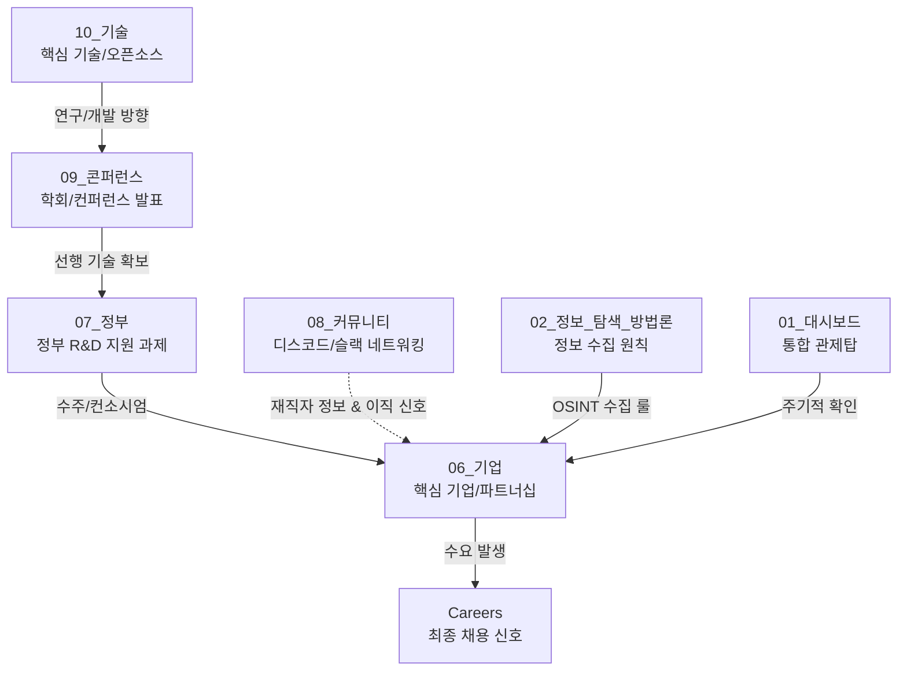
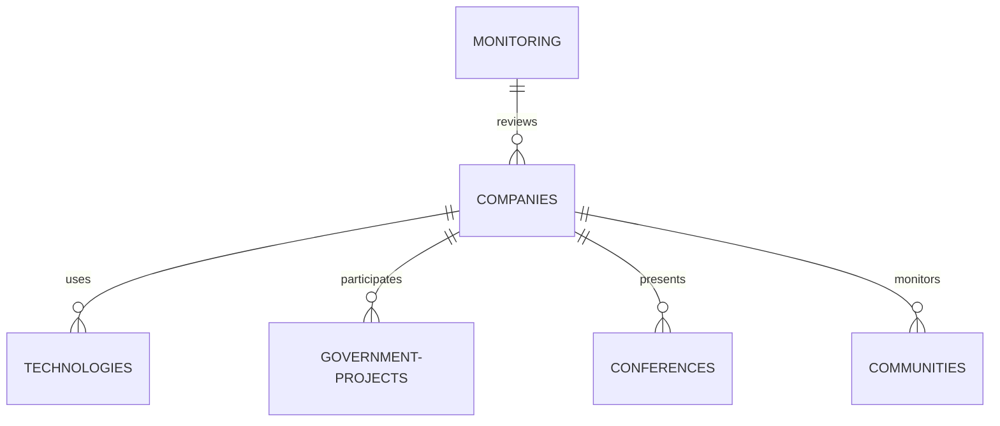

# 00. 볼트 아키텍처 (Vault Architecture)

이 문서는 개인용 Virtual Production & VFX Job Search Operating System (Job Search OS)의 전체 시스템 구조와 설계 사양을 정의합니다. Obsidian 및 Notion에서 관계형 데이터베이스 및 유기적 링크 시스템으로 작동할 수 있도록 폴더, 태그, 관계형 메타데이터(Frontmatter)를 설계했습니다.

---

## 1. 볼트 전체 폴더 구조 (Folder Directory Design)

지속 가능한 지식 관리를 위해 수집된 정보의 성격에 따라 폴더를 구분합니다.

```text
Job_Search_OS/
├── 00_볼트_아키텍처.md         # [본 파일] Vault 전체 아키텍처 및 관계 사양 정의
├── 01_대시보드.md              # 일일/주간/월간 상태 확인 및 액션 아이템 대시보드
├── 02_정보_탐색_방법론.md      # 정보 탐색론 (Upstream Signal 수집 프로토콜)
├── 03_범용_채용_플랫폼.md      # 범용 취업 플랫폼 전략 및 모니터링 가이드
├── 04_개발자_채용_플랫폼.md    # 개발자 전문 취업 플랫폼 전략 및 키워드 셋
├── 05_버추얼_프로덕션_생태계.md # 버추얼 프로덕션 및 VFX 특화 생태계 매핑
├── 06_기업/                    # 국내외 타겟 기업 인텔리전스 개별 노트
├── 07_정부/                    # KOCCA, KOFIC, NIPA 등 정부 사업 및 과제 역추적 노트
├── 08_커뮤니티/                # 국내외 개발자/VFX 디스코드, 슬랙, 포럼 정보
├── 09_콘퍼런스/                # GDC, SIGGRAPH, Unreal Fest 등 핵심 기술 콘퍼런스 기록
├── 10_기술/                    # OpenUSD, Unreal Engine, C++, Graphics 기술별 로드맵 및 채용 신호
├── 11_모니터링/                # 주간(Weekly), 월간(Monthly), 분기(Quarterly) 회고 및 체인지로그
├── 12_템플릿/                  # 각 데이터베이스 객체 생성용 표준 템플릿
└── 13_아카이브/                # 지원 완료, 무효화된 정보, 마감된 채용 공고 백업
```

---

## 2. 태그 체계 (Tag Taxonomy)

노트의 성격과 동적 상태를 신속하게 필터링하기 위해 계층형 태그(Nested Tags)를 사용합니다.

| 분류 | 태그 패턴 | 설명 | 예시 |
| :--- | :--- | :--- | :--- |
| **대분류** | `#job-os/...` | Job Search OS 전체 루트 태그 | `#job-os` |
| **상태** | `#job-os/status/...` | 리소스의 현재 액션 상태 | `#job-os/status/active`, `#job-os/status/monitoring` |
| **도메인** | `#job-os/domain/...` | 전문 분야 또는 관심 도메인 | `#job-os/domain/vp`, `#job-os/domain/vfx`, `#job-os/domain/engine` |
| **소스 유형** | `#job-os/source/...` | 수집된 정보의 출처 분류 | `#job-os/source/conference`, `#job-os/source/gov-project` |
| **우선순위** | `#job-os/priority/...` | 태스크 및 모니터링 긴급도 | `#job-os/priority/high`, `#job-os/priority/low` |

---

## 3. 내부 링크 및 Upstream Information Flow 설계

기존의 단순 "공고 확인 -> 지원" 패러다임을 탈피하고, 기술 및 연구 단계의 업스트림 신호를 포착하여 최하단의 채용 정보로 연결하는 유기적 구조를 가집니다.



---

## 4. 데이터베이스 관계 모델 (Database Relations Schema)

Obsidian의 YAML Frontmatter 속성(Properties)을 기반으로 각 폴더 간의 데이터 관계성을 확보합니다. 



### 각 리소스 데이터베이스 속성 구성표

#### 1) 기업 DB (06_기업)
* **목적**: 타겟 기업 정보, 기술 스택, 채용 시그널 축적
* **관계**: `related_notes: [[Unreal Engine]], [[KOCCA R&D 과제]]` 처럼 기술 및 정부 과제 링크 지정

#### 2) 기술 DB (10_기술)
* **목적**: 특정 기술(예: OpenUSD) 관련 생태계 매핑
* **관계**: `related_notes: [[Pixar]], [[Nvidia]], [[SIGGRAPH 2026]]`

#### 3) 콘퍼런스 DB (09_콘퍼런스)
* **목적**: 최신 R&D 및 엔진 파이프라인 신기술 확인
* **관계**: `related_notes: [[Epic Games]], [[Unreal Fest 2026]]`

---

## 5. Obsidian Dataview & Tasks 활용 예시

이 Vault가 정상적으로 동적 작동하기 위해서는 **Dataview** 플러그인이 필요합니다. 아래는 대시보드와 모니터링 노트에서 정보를 자동으로 수집하기 위한 쿼리 템플릿입니다.

### 1) 모니터링 주기가 도래한 타겟 기업 리스트 추출 (DataviewJS)
```dataview
TABLE status, priority, review_cycle, next_review
FROM "Job_Search_OS/06_기업"
WHERE next_review <= date(today)
SORT next_review ASC
```

### 2) 기술별 타겟 기업 요약 뷰 (Dataview)
```dataview
TABLE status, priority, tech_blog
FROM "Job_Search_OS/06_기업"
WHERE contains(file.outlinks, [[Unreal Engine]])
```

### 3) 이번 주 예정된 채용 모니터링 태스크 (Tasks)
```tasks
not done
path includes Job_Search_OS
due before next week
sort by due
```

---

## 6. Vault 운영 프로세스 가이드

1. **상향식 정보 수집 (Upstream Scouting)**: 컨퍼런스 자료나 오픈USD 깃허브 커밋 등 기술적 변화를 먼저 발견하면 `10_기술` 혹은 `09_콘퍼런스`에 정리합니다.
2. **기업 인텔리전스 매핑**: 이를 토대로 관련 역량을 채용하고 있거나 정부 과제를 수행 중인 기업을 `06_기업`에 등록합니다.
3. **주기적 동기화**: 매주 월요일 아침 `01_대시보드`에 접속하여 Dataview가 띄워주는 "오늘 점검할 기업" 리스트를 바탕으로 타겟 사이트(Careers, Blog)를 점검합니다.
4. **리뷰 실행**: 리뷰가 완료되면 Frontmatter의 `last_verified`를 오늘 날짜로 갱신하고, `next_review`를 리뷰 주기(`review_cycle`이 `weekly`이면 7일 뒤)에 맞게 조정합니다.
