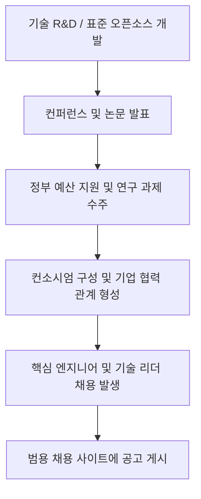
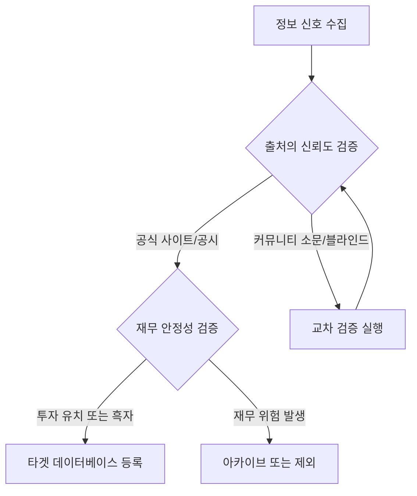

# 02. 정보 탐색 방법론 (Search Methodology)

이 문서는 단순 채용 공고 스크랩을 넘어선 오픈소스 인텔리전스(OSINT) 기반의 정보 수집 및 가치 검증 체계를 설명합니다. 기술 시장의 최상위 신호(Upstream Signal)를 추적하여 채용으로 이어지는 경로를 역설계합니다.

---

## 1. 업스트림 정보 흐름 (Upstream Information Flow)

구직자가 마주하는 최종 이벤트인 채용 공고(Careers)는 기업 활동의 마지막 단계입니다. 본 시스템은 그보다 훨씬 앞선 연구, 기획, 투자 단계의 정보 신호를 추적합니다.

### 단계별 모니터링 시그널
1. **기술 R&D 단계**: GitHub 커밋 트렌드, 새로운 버전 릴리즈 노트(예: OpenUSD 24.xx 버전 발표, Unreal Engine 로드맵).
2. **컨퍼런스 단계**: SIGGRAPH, GDC, Unreal Fest 등에서 기업의 TD(Technical Director) 및 연구진이 신기술 상용 적용 사례 발표.
3. **정부 사업 단계**: 한국콘텐츠진흥원(KOCCA), 정보통신산업진흥원(NIPA) 등의 버추얼 프로덕션 지원사업 및 핵심 기술 개발(R&D) 주관기관 선정 발표.
4. **기업 협력 단계**: 버추얼 프로덕션 스튜디오 구축 컨소시엄, 공동 연구 개발 및 전략적 파트너십 언론 보도.
5. **엔지니어 이직 단계**: LinkedIn 상의 엔지니어 이직(Promotion, Career Move) 발생 및 대규모 프로젝트 수주 신호.

---

## 2. 숨겨진 정보 소스 (Hidden Sources)

기존 채용 공고에 명시되지 않는 핵심 인텔리전스를 수집하기 위한 채널입니다.

### 1. 특허 정보 검색 (KIPRIS)
* **목적**: 타겟 기업이 연구 중이며 미래 핵심 파이프라인으로 삼으려는 독점 기술을 파악합니다.
* **접근**: 특허정보넷 키프리스(KIPRIS)에서 타겟 기업명(예: 덱스터, 넷마블, 자이언트스텝 등)을 검색하여 최신 출원 특허를 조회합니다.
* **활용**: 특허에 기술된 파이프라인(예: 실시간 캐릭터 모션 동기화 장치)은 향후 프로젝트에 즉시 투입될 핵심 인력이 필요함을 입증합니다.

### 2. 정부 과제 제안요청서 (RFP) 분석
* **목적**: 정부가 막대한 예산을 들여 개발하려는 미래 먹거리 기술과, 이를 수주한 기업들의 의무 신규 채용 신호를 파악합니다.
* **접근**: 나라장터(KONEPS), NIPA 공지사항, KOCCA 지원사업 공고 검색.
* **활용**: 제안요청서 내의 기술 요구 사양(RFP)은 곧 해당 프로젝트에 투입되어야 할 기술 스택의 정의서와 같습니다.

### 3. 기술 컨퍼런스 아카이브 역추적
* **목적**: 국내외 컨퍼런스 발표 자료를 통해 특정 기업이 해결하기 위해 애쓰고 있는 기술적 병목(Bottleneck)을 알아냅니다.
* **접근**: ACM Digital Library, SIGGRAPH Asia, GDC Vault, Epic Games 개발자 포럼.
* **활용**: 발표 내용 중 "향후 과제"로 남겨진 부분은 그 기업이 현재 가장 시급하게 채용하려는 직군의 핵심 R&D 과제입니다.

---

## 3. 정보 검증 및 필터링 규칙 (Validation Rules)

수집된 채용 정보가 지원할 가치가 있는 신뢰성 높은 정보인지 검증하는 내부 프로토콜입니다.

### 검증 체크리스트
1. **재무 건전성**: 다트(DART) 전자공시시스템 혹은 혁신의숲, 크레딧잡을 통해 기업의 퇴사율, 매출 추이, 최근 투자 단계(Series A 이상인지 등) 확인.
2. **기술 스택 일치성**: 기업의 GitHub 및 구인 공고 기술 요구 사항이 실제 수행 중인 프로젝트 및 컨퍼런스 발표 스택과 일치하는지 교차 검증.
3. **네트워킹 교차 검증**: 링크드인 프로필 조회를 통해 타겟 부서에 실재하는 엔지니어들의 근속 연수와 핵심 역량 검증.
4. **리뷰 주기 설정**: 정보의 소멸 속도에 따라 일간/주간/월간 모니터링 주기를 할당하여, 만료된 공고에 리소스를 낭비하지 않도록 통제.
