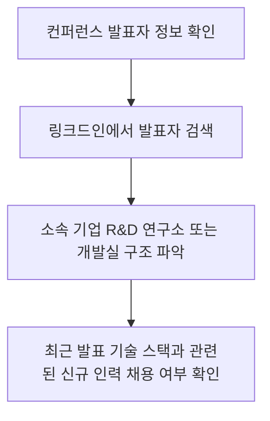

# 기술 콘퍼런스 가이드 (Tech Conference Guide)

이 문서는 버추얼 프로덕션, 컴퓨터 그래픽스, 리얼타임 엔진 R&D 분야의 글로벌 선도 기술 트렌드를 모니터링하기 위한 주요 학회 및 컨퍼런스 스케줄과 정보 역추적 전략을 제시합니다.

---

## 1. 3대 핵심 기술 콘퍼런스 매핑 (Core Conferences)

### 1. GDC (Game Developers Conference)
* **주요 일정**: 매년 3월 경 개최 (미국 샌프란시스코)
* **모니터링 기술 분야**: 실시간 렌더링 최적화, Unreal Engine nDisplay 신버전 로드맵 발표, 모션 캡처 및 AI 캐릭터 물리 시뮬레이션.
* **추적 방법**: GDC Vault 공식 YouTube 및 에픽게임즈 파트너 기술 세션 요약문 조회.

### 2. SIGGRAPH / SIGGRAPH Asia
* **주요 일정**: 매년 7~8월(북미), 11~12월(아시아) 개최
* **모니터링 기술 분야**: 컴퓨터 그래픽스 기초 과학 R&D, 레이 트레이싱 최적화 이론, OpenUSD 스펙 고도화 및 이종 포맷(Maya $\leftrightarrow$ Houdini $\leftrightarrow$ Unreal) 변환 표준 연구.
* **추적 방법**: ACM ACM Digital Library 논문 목록 및 각 스튜디오 기술 백서 역추적.

### 3. Unreal Fest (언리얼 페스트)
* **주요 일정**: 매년 봄/가을 국가별 개최 (에픽게임즈 주관)
* **모니터링 기술 분야**: 가상 프로덕션 현업 워크플로우 실전 적용 사례, nDisplay 분산 렌더링 물리 서버 세팅 실무, LED 컬러 보정(OCIO) 기술 가이드.
* **추적 방법**: 에픽게임즈 공식 YouTube 및 에픽 디벨로퍼 커뮤니티 업로드 발표 자료 정독.

---

## 2. 콘퍼런스 기반 채용 기회 포착 요령 (Conference Intelligence)

1. **발표자 소속 분석**:
   - 컨퍼런스에서 고난도 기술(예: 실시간 나나이트 및 루멘을 활용한 온셋 환경 렌더링)을 발표한 기업은 고도 R&D 파이프라인 개발자 및 TD 수요가 강합니다.
2. **질의응답(Q&A) 추적**:
   - 발표자들이 Q&A 세션에서 언급하는 "향후 해결과제" 혹은 "해결에 어려움을 겪고 있는 부분"을 파악하여 포트폴리오의 중점 R&D 과제로 매치시킵니다.
3. **네트워킹 파티 및 부스 점검**:
   - 현장에 방문할 시 각 기업 부스 리크루터와 엔지니어들과의 커피챗 약속을 미리 조율하여 선제 이력서 검토를 유도합니다.

---

## 3. 연간 모니터링 체크리스트 (Action Plan)

- [ ] **1분기 (3월)**: GDC Vault 최신 비디오 정독 및 주요 엔진 빌드 변경 사항 요약
- [ ] **3분기 (8월)**: SIGGRAPH 최신 그래픽스 논문 요약본 수집 및 OpenUSD 규격 변경 추적
- [ ] **4분기 (10~11월)**: 국내외 Unreal Fest 발표 영상 목록 취합 및 `06_기업` 인텔리전스 정보에 매핑
