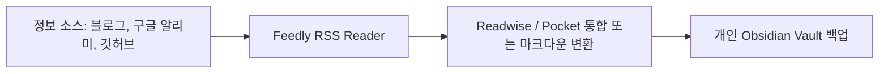

# 11. 모니터링 가이드 (Monitoring Guide)

이 문서는 RSS, 뉴스레터, 구글 알리미, 깃허브 와치, 링크드인 알림 등을 조율하여 최적의 취업 인텔리전스를 자동으로 수집하고, 주기적(주간, 월간, 분기)으로 수집된 정보를 정제하는 모니터링 프로토콜을 규정합니다.

---

## 1. 자동화 모니터링 구축 프로토콜 (Automation Pipeline)

매번 일일이 사이트를 들어가지 않고, 정보를 내 보관소로 밀어 넣는 자동화 아키텍처를 설계합니다.

### 1. RSS Feed 및 Feedly 활용
* **타겟 기술 블로그 구독**: 
  - 에픽게임즈 개발 블로그, Nvidia 개발자 뉴스, Khronos Group 소식 등을 Feedly에 등록합니다.
* **공식 RSS 예시**:
  - Epic Games Blog RSS: `https://www.unrealengine.com/rss`
  - Nvidia Developer Blog RSS: `https://developer.nvidia.com/blog/feed/`
  - GeekNews RSS: `https://news.hada.io/rss`

### 2. Google Alerts (구글 알리미) 설정
* **설정 방식**: 특정 키워드가 구글 색인에 잡힐 때마다 메일 알림을 발송하게 합니다.
* **설정 키워드 셋**:
  - `버추얼 프로덕션 + 지원사업`
  - `한국콘텐츠진흥원 + R&D + 선정`
  - `자이언트스텝 + 채용` / `웨스트월드 + 채용` / `바이브스튜디오스 + 채용`

### 3. GitHub Watch & Release Alert
* **목적**: 주요 그래픽스 오픈소스(OpenUSD, Vulkan SDK, Unreal Engine 등)의 릴리즈 소식과 커밋 트렌드를 포착합니다.
* **적용 방법**:
  - 타겟 GitHub 저장소에 접속하여 `Watch` -> `Custom` -> `Releases`를 선택합니다.
  - 새 버전이 릴리즈될 때마다 알림을 받아, 해당 기술 스택을 활용한 포트폴리오 기여나 개선 기회를 먼저 파악합니다.

### 4. LinkedIn Alert & 키워드 설정
* **적용 방법**:
  - 링크드인 채용정보 탭에서 `Virtual Production TD`, `Engine Programmer`로 검색을 수행한 뒤, '채용공고 알림 설정(Job Alert)'을 활성화합니다.
  - 매일 또는 매주 조건에 맞는 새 공고가 메일 및 앱 푸시로 전송됩니다.

---

## 2. 주기별 리뷰 가이드 (Review Process)

정보 수집 파이프라인이 정상적으로 동작하도록 가꾸는 주기적 점검 사항입니다.

### 1. 주간 리뷰 (Weekly Review)
* **목적**: 지난주 수집된 개별 공고 및 단기적인 채용 시그널 점검
* **주요 확인 대상**:
  - 01_대시보드 내의 "이번 주 확인할 항목" 체크
  - Feedly 피드 미독 기사 분류 및 `06_기업` 또는 `10_기술` 노트에 내용 복사/링크
  - 신규 이력서 지원 여부 및 마감된 공고 `13_아카이브` 이동
* **템플릿 링크**: `[[12_템플릿/주간_리뷰_템플릿]]` 활용

### 2. 월간 리뷰 (Monthly Review)
* **목적**: 포트폴리오 진척 상황 체크 및 기업 타겟 파이프라인 재평가
* **주요 확인 대상**:
  - 최근 습득한 기술적 역량(예: C++ 최적화 파트 등) 이력서 및 포트폴리오 업데이트
  - 타겟 기업들의 채용 가능성 재점검 및 랭킹 조정(Reach/Match/Safety 분류)
  - 모니터링 주기 속성(`review_cycle`, `next_review`) 강제 갱신
* **템플릿 링크**: `[[12_템플릿/월간_리뷰_템플릿]]` 활용

### 3. 분기 리뷰 (Quarterly Review)
* **목적**: 거시적인 정부 R&D 과제 수주 사이클 점검 및 기술 스택 우선순위 재조정
* **주요 확인 대상**:
  - 상반기/하반기 KOCCA, NIPA 등 국가 지원사업 선정 결과 역추적 점검
  - 국내외 그래픽스 트렌드(GDC, SIGGRAPH 발표 피처)에 맞추어 `10_기술` 로드맵 수정
  - 시스템 설계 사양(`00_볼트_아키텍처`) 자체 리팩토링 진행

---

## 3. 체인지로그 기록 원칙 (Change Log Rules)

* **문서 복제 방지**: 신규 채용 정보나 변경된 정보 발생 시, 기존의 분석 문서를 처음부터 다시 작성하는 것이 아니라 업데이트된 부분만 갱신(Delta Update)합니다.
* **속성 변경**: 업데이트 완료 후 Frontmatter의 `last_verified`를 당일 날짜로 수정하고, `next_review`를 리뷰 주기에 따라 가산하여 갱신합니다.
* **로그 스크랩**: 노트 하단 `모니터링 체인지로그`에 언제 어떤 정보가 추가/수정되었는지 간결하게 기록합니다.
  - 형식 예시: `- **YYYY-MM-DD**: [추가/수정/삭제] 세부 변경 사항 기록 (담당자 또는 비고)`
