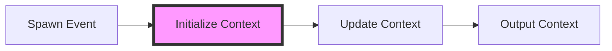

# Unity VFX Graph - Initialize Context 정리

> **참고 링크**: [URP VFX Learning Templates (1) - 어제와 내일의 나 그 사이의 이야기](https://lycos7560.com/unity/urp-vfx-learning-templates-1/39596/#1-contextflow)

> **요약**: Unity VFX Graph에서 파티클 생성의 첫 관문인 **Initialize Context**의 역할과 핵심 설정(Space, Data Type, Capacity, Bounds)을 분석한다. 파티클 수명 주기의 시작점을 완벽히 통제하는 방법을 다룬다.

## 목차
* TOC
{:toc}

---

## 1. Initialize Context 란?

**Initialize Context**는 `Spawn Event` 또는 `GPU Event`를 전달받아 **새로운 파티클(또는 파티클 스트립)을 초기화**하는 역할을 수행한다. 파티클이 생성되는 시작점과 같다.

### 1.1. 파티클 실행 흐름 (Flow)

파티클 시스템은 다음과 같은 단방향 라이프사이클을 거친다.

### 1.2. 주요 특징
*   파티클이 처음 생성될 때 **단 한 번만** 실행된다. 초기 발사 각도와 설정을 세팅하는 작업이다.
*   이후 프레임 단위의 연산은 `Update Context`와 `Output Context`로 흐름이 이양된다.

### 1.3. 용어 설명
*   **파티클(Particle)**: 독립적으로 짧은 수명을 가지는 단일 시각적 효과 단위다 (불꽃, 연기, 먼지 등).
*   **파티클 스트립(Particle Strip)**: 파티클이 선형 체인 구조로 이어진 형태다 (검기, 투사체 꼬리, 빛줄기 궤적 등).

---

## 2. 메뉴 접근 경로

VFX Graph 에디터 작업 공간에서 Node를 추가할 때 다음 경로를 따른다.
*   **Context → Initialize Particle**

---

## 3. 핵심 설정 항목 (Context Settings)

Initialize Context Block의 인스펙터 속성을 분석해 본다.

### 3.1. Space (시뮬레이션 좌표계)

| 옵션 | 설명 | 사용 예시 |
| :--- | :--- | :--- |
| **Local** | 이펙트가 부모 게임오브젝트의 Transform (위치/회전)에 완전히 종속된다. | 캐릭터 손끝에 매달려 같이 움직이는 마법 진 형태 |
| **World** | 파티클이 한 번 스폰되면 부모가 이동해도 그 자리에 잔류한다. | 자동차 머플러에서 뿜어져 나와 허공에 흩어지는 배기가스 |

### 3.2. Data Type (파티클 위상)

이펙트가 렌더링할 기하학적 형태의 본질을 결정한다.

| 옵션 | 설명 | 시각적 특징 |
| :--- | :--- | :--- |
| **Particle** | 독립적인 점 기반 파티클이다. | 파편들이 각자 흩날린다. |
| **Particle Strip** | 하나의 연속된 면/선으로 이어진 파티클 띠다. | 부드럽게 이어지는 곡선 궤적을 형성한다. |

### 3.3. Capacity (최대 파티클 수용량)

*   전체 시뮬레이션 라이프사이클에서 동시에 존재할 수 있는 **최대 파티클 개수(UInt)** 다.
*   GPU 메모리 페이징 사이즈를 결정하는 중요한 척도다. 이 값을 낭비하면 프로젝트 성능(FPS)이 저하될 수 있다. 메모리 오버플로우를 막는 역할도 수행한다.

### 3.4. Particle Per Strip Count (스트립 길이)

*   `Data Type`이 **Particle Strip**일 때만 활성화되는 옵션이다.
*   1개의 연속된 줄기(Strip)를 구성하는 버텍스(파티클)의 마디 개수를 조절한다. 개수가 늘어날수록 곡선이 더욱 부드러워진다.

### 3.5. Bounds Setting Mode (컬링 바운딩 박스)

이펙트가 차지하는 **3차원 공간 범위(AABB, Axis-Aligned Bounding Box)** 를 계산하는 방식을 지정한다. 이 상자를 카메라가 인지하지 못하면 Unity는 파티클 렌더링을 스킵하여 성능을 확보한다.

| 옵션 | 설명 | 장점 | 단점 |
| :--- | :--- | :--- | :--- |
| **Manual** | X, Y, Z 사이즈를 사용자가 직접 설정한다. | 오버헤드가 적고 성능이 우수하다. | 파티클이 박스 밖으로 나가면 보이지 않게 된다. |
| **Recorded** | 에디터에서 움직임 궤적을 샘플링하여 크기를 확정한다. | 자동화되어 편리하며 런타임 계산 비용이 없다. | 범위 변동이 심한 이펙트에는 부적합하다. |
| **Automatic** | 매 프레임 GPU가 파티클들의 최대 분포 경계를 직접 계산한다. | 파티클이 화면에서 잘리는 현상이 없다. | 매 프레임 추가 연산이 발생한다. |

> [!important]
> 최적화를 위해서는 `Recorded`로 베이스라인 박스를 설정한 뒤, 여유 공간(Padding)을 주어 `Manual` 로 고정하는 것이 권장되는 방식이다.

---

## 4. Input 속성

Initialize Context 블록 상단에 노출되는 외부 입력 포트들이다.

### 4.1. Bounds (AABox)
*   Manual 모드일 때 이펙트가 작용하는 최대 영역 박스 형태를 정의한다.

### 4.2. Bounds Padding (Vector3)
*   수동으로 설정한 바운딩 박스 표면에 **여유 마진(Margin) 공간**을 추가한다.
*   카메라 전환 시 경계선에 걸친 파티클이 급격히 사라지는 현상을 방어하는 용도다.

### 4.3. Culling Flags (시스템 세팅)

에셋 글로벌 세팅에서 카메라 판별 방식을 결정한다.
*   **Off**: 시야와 관계없이 무조건 그린다.
*   **Based On Bounds**: 바운딩 박스가 카메라 시야 내부에 있는지 검사한다. (기본값)
*   **Always**: 렌더링을 수행하지 않는다. (디버깅용)

---

## 5. 상세 동작 원리와 제약사항

### 5.1. Overspawn 방지 설계
Initialize Context 내부에 Block 노드를 추가하여 파티클의 초기 Color, Velocity, Position 등을 설정할 수 있다.
만약 외부에서 `Capacity`를 초과하는 생성 신호를 보낼 경우, 초과분은 **생성되지 않고 무시된다.** 

### 5.2. Alive 속성을 이용한 즉각 처형
Initialize 블록 안에서 파티클의 시스템 속성 `Alive` 값을 `false` 로 설정하면, 파티클은 생성되자마자 **Dead 판정**을 받는다.
*   이 기법은 특정 조건에 미달하는 파티클들을 효율적으로 제거하는 최적화 방식으로 활용된다.
*   단, 메모리 공간은 할당받은 상태이므로 전체 Capacity 카운트를 소모하게 된다.

### 5.3. Source Attribute (속성 상속)
Initialize 단계에서 이전 단계의 데이터를 물려받을 수 있다.
*   `Get Attribute (Source)` 노드나 `Inherit <Attribute>` Block을 사용한다.
*   이 방식을 통해 생성 지점의 좌표나 부모 파티클의 속도 등을 계승할 수 있다. 

---

## 6. Input Flow 호환성 주의사항 (에러 유발)

VFX Graph는 노드 연결에 있어 엄격한 규칙을 가진다.

✅ **가능한 연결 방식**
*   여러 개의 `Spawn Context`를 하나의 Initialize에 연결하는 방식이다.
*   여러 개의 `Event Context` 를 연결하는 방식이다.

❌ **혼합 금지**
*   **CPU 기반 (Spawn/Event) 와 GPU Event 노드를 하나의 Initialize에 동시에 연결해서는 안 된다.**

> [!warning]
> 이러한 연결은 다음과 같은 예외를 발생시키며 컴파일 오류를 유발한다.
> `System.InvalidOperationException: Cannot mix GPU & CPU spawners in init`

---

## 7. 결론

Initialize Context는 파티클 수명 주기의 **시작점**과 같다. 이곳에서 `Capacity`를 통한 생성 수량이 통제되며, `Bounds`로 영역이 정해지고, `Space`를 통해 좌표계가 적용된다. 이러한 설정들을 정밀하게 조정해야 성능과 시각적 효과를 모두 확보할 수 있다.

 

### 참고 및 추가 자료
*   [Unity VFX Graph 공식 Document](https://docs.unity3d.com/Packages/com.unity.visualeffectgraph@latest)
*   [VFX Graph 깃허브 Examples](https://github.com/Unity-Technologies/VisualEffectGraph-Samples)
