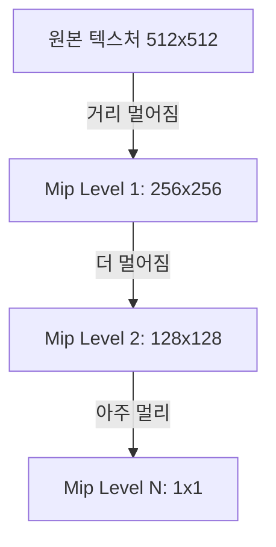

## 요약
> **요약**: 텍스처(Texture)의 기본 개념과 텍스처 좌표 매핑을 이해하고, 이미지를 적용할 때 발생하는 경계선 래핑 모드, 텍스처 필터링, 그리고 밉맵(Mipmap) 최적화에 대해 학습한다.

## 목차
* TOC
{:toc}

---

**자료 출처**: [LearnOpenGL](https://learnopengl.com/)

## 텍스처 (Texture)

텍스처는 2D 이미지 데이터이며, 폴리곤 표면에 적용하여 객체의 세부 디테일을 저비용으로 구현할 수 있다.

{: width="400" }
_삼각형에 텍스처를 적용한 렌더링 결과_

텍스처를 적용하기 위해서는 삼각형의 각 정점이 2D 텍스처 이미지의 어느 지점에 매핑되는지 정의해야 한다. 이를 **텍스처 좌표 매핑 (Texture Coordinate Mapping)** 이라 한다.

> [!info] 
> 텍스처 좌표는 일반적으로 **(u, v) 또는 (s, t)** 변수로 표기하며, $0.0 \sim 1.0$ 사이의 정규화(Normalized)된 실수값을 사용한다.

{: width="500" }
_2D 텍스처 좌표계와 삼각형 정점의 대응 구조_

삼각형의 매핑 구조를 좌표로 정리하면 다음과 같다.

*   삼각형의 왼쪽 하단 점 $\rightarrow$ 텍스처 좌표 $(0.0, 0.0)$
*   오른쪽 하단 점 $\rightarrow$ 텍스처 좌표 $(1.0, 0.0)$
*   가운데 상단 정점 $\rightarrow$ 텍스처 좌표 $(0.5, 1.0)$

도출된 텍스처 좌표를 버텍스 셰이더(Vertex Shader)에 전달하면, 시스템은 파이프라인에서 정점 사이를 보간하여 프래그먼트 셰이더(Fragment Shader)로 전달한다. 프래그먼트 셰이더는 보간된 텍스처 좌표를 기반으로 픽셀 색상을 샘플링하여 렌더링한다.

---

## 텍스처 래핑 모드 (Texture Wrapping Mode)  

텍스처 좌표의 표준 범위는 $(0,0) \sim (1,1)$이다. 이 **범위를 초과하는 좌표**를 참조할 경우의 처리 방식은 OpenGL에서 제공하는 4가지 **텍스처 래핑 모드 (Texture Wrapping Mode)** 를 통해 설정할 수 있다.

{: width="700" }
_좌측부터 GL_REPEAT, GL_MIRRORED_REPEAT, GL_CLAMP_TO_EDGE, GL_CLAMP_TO_BORDER 모드_

1.  **GL_REPEAT** : 기본값이다. 텍스처를 반복하여 배치한다.
2.  **GL_MIRRORED_REPEAT** : 이미지를 반전 반복하여 연속적인 패턴을 생성한다.
3.  **GL_CLAMP_TO_EDGE** : 텍스처의 가장자리 픽셀 색상을 확장하여 나머지 영역을 채운다.
4.  **GL_CLAMP_TO_BORDER** : 범위를 벗어난 영역에 사용자가 지정한 특정 색상을 적용한다.

래핑 모드는 `glTexParameteri` 함수를 사용하여 s축(x), t축(y) 각각 독립적으로 설정 가능하다.

```cpp
glTexParameteri(GL_TEXTURE_2D, GL_TEXTURE_WRAP_S, GL_MIRRORED_REPEAT);
glTexParameteri(GL_TEXTURE_2D, GL_TEXTURE_WRAP_T, GL_MIRRORED_REPEAT);
```

`GL_CLAMP_TO_BORDER` 모드를 사용할 경우, 적용할 색상을 추가로 지정해야 한다. 이때는 `glTexParameterfv` 함수를 활용한다.

```cpp
float borderColor[] = { 1.0f, 1.0f, 0.0f, 1.0f }; // 노란색 불투명 색상 지정
glTexParameterfv(GL_TEXTURE_2D, GL_TEXTURE_BORDER_COLOR, borderColor);
```

---

## 텍스처 필터링 (Texture Filtering) 

폴리곤의 화면 크기가 텍스처 해상도보다 크거나 작을 때, 앨리어싱이나 픽셀화 현상을 방지하고 시각적 품질을 유지하기 위해 **텍스처 필터링 (Texture Filtering)** 기술을 적용한다.

> [!info]
> **텍스처 필터링**은 텍스처 샘플링 시 화면 픽셀과 텍스처 좌표가 일치하지 않을 때 색상을 산출하는 방식이다.

텍스처는 **텍셀 (Texel)** 단위로 구성된다. 화면 픽셀과 텍셀을 매핑하는 과정에서 필터링이 수행되며, 주로 `GL_NEAREST`와 `GL_LINEAR`가 사용된다.

### GL_NEAREST (근접 필터링)

{: width="500" }

`GL_NEAREST`는 OpenGL의 기본 필터링 방식이다. 지정된 텍스처 좌표에서 **가장 가까운 단일 텍셀**의 색상을 선택한다. 확대 시 계단 현상이 명확하게 나타나며, 픽셀 아트 스타일의 렌더링에 적합하다.

### GL_LINEAR (선형 보간 필터링)

{: width="500" }

`GL_LINEAR` 방식은 텍스처 좌표 주변의 **인접한 4개 텍셀**을 샘플링하여 거리 기반의 **선형 보간(Linear Interpolation)** 연산을 수행한다. 결과적으로 부드러운 전환 효과(블러링)가 발생한다.

{: width="600" }
_확대 시 GL_NEAREST (좌) 와 GL_LINEAR (우) 의 비교_

확대(Magnification)와 축소(Minification) 시 각각 다른 필터링 방식을 적용할 수 있다.

```cpp
// 텍스처가 축소될 때는 근접 필터링 적용
glTexParameteri(GL_TEXTURE_2D, GL_TEXTURE_MIN_FILTER, GL_NEAREST);
// 텍스처가 확대될 때는 선형 보간 필터링 적용
glTexParameteri(GL_TEXTURE_2D, GL_TEXTURE_MAG_FILTER, GL_LINEAR);
```

## 밉맵 (Mipmap) 

객체가 카메라로부터 멀어질 때 고해상도 텍스처를 그대로 사용하면 **캐시 미스(Cache Miss) 및 메모리 대역폭 낭비, 앨리어싱 노이즈**가 발생할 수 있다.

이를 최적화하기 위해 원본 텍스처를 단계별로 축소하여 사전 생성한 이미지 세트인 **밉맵 (Mipmap)** 기법을 사용한다. 밉맵은 해상도를 1/2씩 줄여가며 생성된 텍스처 체인이다.



{: width="500" }
_텍스처 밉맵 레벨 체인 구조_

OpenGL은 카메라와의 거리를 기반으로 적절한 밉맵 레벨을 자동으로 참조한다. `glGenerateMipmap` 함수를 호출하면 전체 밉맵 체인을 자동으로 생성할 수 있다.

> [!warning]
> 밉맵 레벨 간 전환 시에도 필터링 설정이 필요하며, OpenGL은 이를 제어할 수 있는 옵션을 제공한다.

### 밉맵 필터링 옵션 

축소 필터(`GL_TEXTURE_MIN_FILTER`)에 적용되는 주요 밉맵 필터 옵션은 다음과 같다.

*   `GL_NEAREST_MIPMAP_NEAREST` : 적합한 단일 밉맵 레벨을 선택하고 `GL_NEAREST` 방식으로 샘플링한다.
*   `GL_LINEAR_MIPMAP_NEAREST` : 적합한 단일 밉맵 레벨을 선택하고 `GL_LINEAR` 방식으로 샘플링한다.
*   `GL_NEAREST_MIPMAP_LINEAR` : 인접한 **두 밉맵 레벨을 선형 보간**하여 혼합하고, 최종 샘플링은 **최근접** 방식으로 수행한다.
*   `GL_LINEAR_MIPMAP_LINEAR` : (Trilinear 필터링) 인접한 두 밉맵 레벨을 선형 보간하여 혼합하고, 텍셀 또한 선형 보간하여 최종 색상을 계산한다.

```cpp
// 밉맵 레벨 간 전환 및 텍셀 샘플링 모두 선형 보간 적용 (Trilinear 필터링)
glTexParameteri(GL_TEXTURE_2D, GL_TEXTURE_MIN_FILTER, GL_LINEAR_MIPMAP_LINEAR);
// 확대 시에는 밉맵을 사용하지 않으므로 단순 선형 보간 적용
glTexParameteri(GL_TEXTURE_2D, GL_TEXTURE_MAG_FILTER, GL_LINEAR);
```

> [!tip]
> 확대 필터(`GL_TEXTURE_MAG_FILTER`)에는 밉맵 옵션을 설정할 수 없다. 밉맵은 축소 시에만 적용되는 기법이기 때문에 잘못된 설정 시 `GL_INVALID_ENUM` 오류가 발생할 수 있다.

---

## stb_image.h 라이브러리 활용 

`stb_image.h`는 C/C++ 환경에서 JPG, PNG 등 다양한 이미지 형식을 로드할 수 있는 싱글 헤더 라이브러리다.

```cpp
#define STB_IMAGE_IMPLEMENTATION
#include "stb_image.h"
```

해당 라이브러리는 선언부와 구현부가 통합된 형태이므로, `#include` 직전에 반드시 `#define STB_IMAGE_IMPLEMENTATION`을 선언해야 내부 구현부가 컴파일된다.

> [!warning]
> **중복 정의(Multiple Definition) 오류 주의**  
> 이 매크로 선언은 프로젝트 내 **단 하나의 `.cpp` 소스 파일**에서만 수행되어야 한다. 여러 파일에서 중복 선언될 경우 링킹 단계에서 충돌 오류가 발생한다.

---

## 텍스처 객체 생성 및 데이터 바인딩

### 1. 이미지 로드

```cpp
int width, height, nrChannels;
// 이미지 파일 경로를 통해 픽셀 데이터 포인터를 획득한다.
unsigned char *data = stbi_load("container.jpg", &width, &height, &nrChannels, 0);
```

`stbi_load` 함수는 이미지의 메타데이터(너비, 높이, 채널 수)를 반환하며, 실제 픽셀 데이터가 저장된 메모리 주소를 제공한다.

### 2. 텍스처 객체 생성

```cpp
unsigned int texture;
glGenTextures(1, &texture); // 텍스처 객체 생성 및 ID 할당
```

기존 VAO, VBO 생성 방식과 동일하게 정수 ID를 통해 관리된다.

### 3. 바인딩 및 데이터 전송

```cpp
// 2D 텍스처 타겟에 바인딩
glBindTexture(GL_TEXTURE_2D, texture);

// 픽셀 데이터를 GPU 메모리로 전송하여 텍스처 생성
glTexImage2D(GL_TEXTURE_2D, 0, GL_RGB, width, height, 0, GL_RGB, GL_UNSIGNED_BYTE, data);

// 밉맵 체인 자동 생성
glGenerateMipmap(GL_TEXTURE_2D);
```

`glTexImage2D` 함수의 주요 매개변수는 다음과 같다.

1.  **타겟 (Target)**: `GL_TEXTURE_2D` 등 텍스처 차원 지정.
2.  **밉맵 레벨 (Mipmap Level)**: 베이스 레벨은 0.
3.  **내부 포맷 (Internal Format)**: GPU 내부의 픽셀 저장 형식 (예: `GL_RGB`).
4.  **너비/높이**: 이미지 해상도.
5.  **테두리 (Border)**: 항상 0 (레거시 지원용).
6.  **입력 포맷 (Format)**: 원본 데이터의 포맷 (예: `GL_RGB`).
7.  **입력 데이터 타입 (Type)**: 데이터 형식 (`GL_UNSIGNED_BYTE`).
8.  **데이터 포인터 (Data)**: 실제 픽셀 데이터 메모리 주소.

> [!tip] 
> 데이터 전송 완료 후 시스템 메모리(RAM)에 로드된 원본 데이터는 불필요하므로, `stbi_image_free(data);`를 호출하여 메모리 누수를 방지해야 한다.

```cpp
stbi_image_free(data); // 로딩용 임시 메모리 해제
```

---

## 텍스처 파이프라인 적용

VBO에 `positions`와 `colors` 외에 `texture coords` 속성을 추가하여 데이터를 확장한다.

### 1. 정점 데이터 확장

```cpp
float vertices[] = {
    // positions (x,y,z)  // colors (R,G,B)   // texture coords (s,t)
     0.5f,  0.5f, 0.0f,   1.0f, 0.0f, 0.0f,   1.0f, 1.0f,   // 우측 상단
     0.5f, -0.5f, 0.0f,   0.0f, 1.0f, 0.0f,   1.0f, 0.0f,   // 우측 하단
    -0.5f, -0.5f, 0.0f,   0.0f, 0.0f, 1.0f,   0.0f, 0.0f,   // 좌측 하단
    -0.5f,  0.5f, 0.0f,   1.0f, 1.0f, 0.0f,   0.0f, 1.0f    // 좌측 상단
};
```

데이터 속성이 증가함에 따라 Stride는 `8 * sizeof(float)`로 설정하며, 텍스처 좌표의 Offset은 `6 * sizeof(float)` 지점이 된다.

### 2. 버텍스 셰이더 수정

텍스처 속성을 2번(`location = 2`)으로 정의하여 프래그먼트 셰이더로 전달한다.

```glsl
#version 330 core
layout (location = 0) in vec3 aPos;
layout (location = 1) in vec3 aColor;
layout (location = 2) in vec2 aTexCoord;

out vec3 ourColor;
out vec2 TexCoord;

void main()
{
    gl_Position = vec4(aPos, 1.0);
    ourColor = aColor;
    TexCoord = aTexCoord;
}
```
{: file="shader.vert" }

### 3. 프래그먼트 셰이더 수정 

전달받은 `TexCoord`와 텍스처 객체를 결합하여 최종 색상을 계산한다.

```glsl
#version 330 core
out vec4 FragColor;
  
in vec3 ourColor;
in vec2 TexCoord;

// 텍스처 유니폼 샘플러
uniform sampler2D ourTexture; 

void main()
{
    // texture 함수를 통해 uv 좌표에 대응하는 색상을 샘플링한다.
    FragColor = texture(ourTexture, TexCoord);
}
```
{: file="shader.frag" }

GLSL의 `sampler2D` 자료형과 `texture()` 내장 함수를 사용하면, OpenGL이 자동으로 텍스처 데이터를 참조하여 보간된 좌표에 맞는 픽셀 색상을 산출한다.

---

## 텍스처 유닛 (Texture Unit) 

단일 객체에 다중 텍스처를 적용하기 위해 **텍스처 유닛(Texture Unit)** 슬롯을 활용할 수 있다.

### 텍스처 유닛 활성화 및 바인딩

OpenGL은 기본적으로 `GL_TEXTURE0` 유닛을 활성화한다. 다중 텍스처 사용 시 명시적인 활성화가 필요하다.

```cpp
glActiveTexture(GL_TEXTURE0); // 0번 유닛 활성화
glBindTexture(GL_TEXTURE_2D, texture1); 
  
glActiveTexture(GL_TEXTURE1); // 1번 유닛 활성화
glBindTexture(GL_TEXTURE_2D, texture2); 

glBindVertexArray(VAO);
glDrawElements(GL_TRIANGLES, 6, GL_UNSIGNED_INT, 0);
```

### 샘플러 매핑

프래그먼트 셰이더에서 각 샘플러 유니폼이 어느 텍스처 유닛을 참조할지 설정해야 한다.

```glsl
#version 330 core

uniform sampler2D texture1;
uniform sampler2D texture2; 

void main()
{
    // 두 텍스처 색상을 8:2 비율로 혼합
    FragColor = mix(texture(texture1, TexCoord), texture(texture2, TexCoord), 0.2);
}
```
{: file="shader.frag" }

C++ 코드에서 샘플러 변수에 유닛 인덱스 값을 할당한다.

```cpp
ourShader.use(); 

// texture1 샘플러를 0번 유닛(GL_TEXTURE0)에 매핑
glUniform1i(glGetUniformLocation(ourShader.ID, "texture1"), 0); 
// texture2 샘플러를 1번 유닛(GL_TEXTURE1)에 매핑
ourShader.setInt("texture2", 1); 
```

### 이미지 상하 반전 처리

대부분의 이미지 포맷은 좌측 상단을 원점으로 상정하나, OpenGL은 좌측 하단을 원점으로 처리한다. 이를 해결하기 위해 이미지 로드 시 $Y$축을 뒤집는 설정을 적용한다.

```cpp
stbi_set_flip_vertically_on_load(true); // 로드 시 Y축 반전 적용
unsigned char *data = stbi_load("awesomeface.png", &width, &height, &nrChannels, 0);
```

### 최종 결과

다중 텍스처링을 통해 두 이미지가 혼합된 렌더링 결과물을 확인할 수 있다.

{: width="400" }

---
