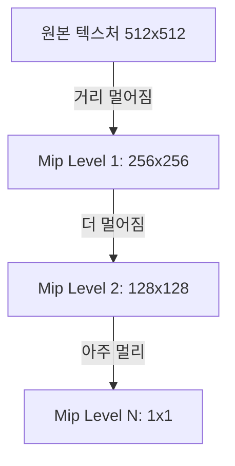

## 요약
> **요약**: 텍스처(Texture)의 기본 개념과 텍스처 좌표 매핑을 이해하고, 이미지를 씌울 때 발생하는 경계선 래핑 모드, 텍스처 필터링, 그리고 밉맵(Mipmap) 최적화에 대해 학습한다.

## 목차
* TOC
{:toc}

---

**자료 출처**: [LearnOpenGL](https://learnopengl.com/)

## 텍스처 (Texture)

텍스처는 일반적으로 2D 이미지 데이터이며, 폴리곤(오브젝트)의 표면에 씌우면 복잡한 겉모습과 질감을 매우 적은 연산 비용으로 표현할 수 있다.

{: width="400" }
_삼각형에 벽돌 텍스처를 성공적으로 입힌 결과_

이러한 결과를 얻기 위해서는 삼각형의 각 기하학적 정점이 2D 텍스처 이미지의 어느 포인트에 매핑되어야 하는지를 수학적으로 규정해야 한다. 이를 **텍스처 좌표 매핑 (Texture Coordinate Mapping)** 이라고 한다. 

> [!info] 
> 텍스처 좌표는 보통 **(u, v) 또는 (s, t)** 변수로 표기하며, 보통 $0.0 \sim 1.0$ 사이의 정규화(Normalized)된 실수값을 사용한다.

{: width="500" }
_2D 텍스처의 (s, t) 좌표계와 삼각형 버텍스의 대응 구조_

위 삼각형의 매핑 구조를 좌표로 정리하면 다음과 같다.

*   삼각형의 왼쪽 하단 점 $\rightarrow$ 텍스처 좌표 $(0.0, 0.0)$
*   오른쪽 하단 점 $\rightarrow$ 텍스처 좌표 $(1.0, 0.0)$
*   가운데 위 정점 $\rightarrow$ 텍스처 좌표 $(0.5, 1.0)$

도출된 텍스처 좌표를 버텍스 셰이더(Vertex Shader)에 전달하면, 시스템은 파이프라인 정점 사이의 공간을 보간하여 프래그먼트 셰이더(Fragment Shader)로 전달한다. 프래그먼트 셰이더는 이 보간된 텍스처 좌표를 픽셀에 대응시켜 최종적으로 이미지를 그려낸다.

---

## 텍스처 래핑 모드 (Texture Wrapping Mode)  

텍스처 좌표의 정상적인 범위는 $(0,0) \sim (1,1)$이라고 하였다. 만약 프로그래머가 고의든 실수든 **이 범위를 초과하는 좌표**를 참조하게 된다면 시스템이 어떻게 처리할까? OpenGL은 범위를 벗어난 영역을 처리하는 4가지 **텍스처 래핑 모드 (Texture Wrapping Mode)** 를 제공한다.

{: width="700" }
_좌측부터 GL_REPEAT, GL_MIRRORED_REPEAT, GL_CLAMP_TO_EDGE, GL_CLAMP_TO_BORDER 모드_

1.  **GL_REPEAT** : 기본값(Default). 텍스처 이미지를 벽지처럼 반복 타일링한다.
2.  **GL_MIRRORED_REPEAT** : 반복 시 거울처럼 이미지를 반전시켜 끊김 없는 패턴을 유도한다.
3.  **GL_CLAMP_TO_EDGE** : 텍스처의 가장자리 픽셀 색상을 쭉 늘여서 여백을 채운다.
4.  **GL_CLAMP_TO_BORDER** : 범위를 벗어난 좌표 공간에 사용자가 임의로 지정한 특정 단색(단일 색상) 컬러를 도포한다.

래핑 모드는 `glTexParameteri` 함수를 사용하여 s축(x), t축(y) 각각 독립적으로 설정할 수 있다.

```cpp
glTexParameteri(GL_TEXTURE_2D, GL_TEXTURE_WRAP_S, GL_MIRRORED_REPEAT);
glTexParameteri(GL_TEXTURE_2D, GL_TEXTURE_WRAP_T, GL_MIRRORED_REPEAT);
```

만일 `GL_CLAMP_TO_BORDER` 모드를 채택했다면, 초과 영역을 무슨 색으로 채울지 프레임워크에 추가로 알려주어야 한다. 이때는 배열 값을 넘길 수 있는 `glTexParameterfv` 함수를 활용한다.

```cpp
float borderColor[] = { 1.0f, 1.0f, 0.0f, 1.0f }; // 노란색 불투명 색상 지정
glTexParameterfv(GL_TEXTURE_2D, GL_TEXTURE_BORDER_COLOR, borderColor);
```

---

## 텍스처 필터링 (Texture Filtering) 

만일 폴리곤(삼각형) 화면 상의 크기가 텍스처 원본 크기보다 훨씬 크다면, 텍스처 픽셀이 확대되면서 해상도가 깨지거나 모자이크처럼 보이는 현상이 일어난다. 반대로 축소될 때도 픽셀이 소실되며 어색해진다. 이를 극복하고 부드러운 화질을 유지하기 위해 **텍스처 필터링 (Texture Filtering)** 기술을 사용한다.

> [!info]
> **텍스처 필터링**이란 텍스처 샘플링 중에 화면 픽셀 크기와 텍스처 좌표가 정확히 일치하지 않을 때, 렌더링 파이프라인이 어떤 방식으로 색상을 추산해서 칠할지 결정하는 기법이다.

텍스처는 **텍셀 (Texel)** 이라는 기본 픽셀 단위로 구성된다. (Texture Elements의 약자). 화면의 모니터 픽셀과 텍스처의 텍셀을 매핑하는 과정에서 필터링이 개입한다. 가장 흔히 쓰이는 방식은 `GL_NEAREST`와 `GL_LINEAR`다.

### GL_NEAREST (근접 필터링)

{: width="500" }

`GL_NEAREST`는 OpenGL의 기본(Default) 텍스처 필터링 방식이다. 소수점을 포함한 텍스처 좌표가 주어지면, 수학적으로 **가장 거리가 가까운 단 하나의 텍셀**을 선택해서 그 색상을 100% 그대로 입힌다. 위 그림을 보면 중심점이 가스레인지 불꽃 마크 텍셀 구간에 위치하므로, 해당 텍셀 컬러가 그대로 반영되는 것을 볼 수 있다. 확대 시 도트 스파이크(계단 현상)가 명확하게 보이는 것이 특징이다 (레트로 픽셀 아트 게임에 적합).

### GL_LINEAR (선형 보간 필터링)

{: width="500" }

`GL_LINEAR` 방식은 텍스처 좌표 주변에 **인접한 4개의 텍셀**을 찾은 뒤, 각 텍셀 중심과 텍스처 좌표 간의 거리에 비례하여 **선형 보간(Linear Interpolation)** 덧셈 연산을 수행해 최종 색상을 도출해낸다. 가까운 텍셀의 색상 지분이 더 크게 섞이며 결괏값이 부드럽게 흐려진다(블러링).

{: width="600" }
_확대 시 GL_NEAREST (좌) 와 GL_LINEAR (우) 의 차이. 우측이 확연히 부드럽다._

텍스처가 확대(Magnification)될 때와 축소(Minification)될 때 각각 다른 필터링 방식을 적용할 수 있다.

```cpp
// 텍스처가 축소될 때는 가장 가까운 텍셀 하나만 샘플링
glTexParameteri(GL_TEXTURE_2D, GL_TEXTURE_MIN_FILTER, GL_NEAREST);
// 텍스처가 화면에 확대될 때는 매끄러운 선형 보간 적용
glTexParameteri(GL_TEXTURE_2D, GL_TEXTURE_MAG_FILTER, GL_LINEAR);
```

## 밉맵 (Mipmap) 

오브젝트에 고해상도 텍스처를 입힌 후 멀리서 관찰한다고 가정해보자. 카메라는 멀리 있는데 텍스처는 불필요하게 초고해상도라면, 프래그먼트 셰이더는 극도로 작은 면적 안에서 컬러를 결정하기 위해 방대한 텍셀 풀에서 샘플링을 해야 하므로 **캐시 미스(Cache Miss)가 발생하고 심각한 메모리 대역폭 낭비와 앨리어싱(Aliasing) 노이즈**를 초래한다.

그래서 탄생한 기법이 기존 텍스처 이미지를 사전에 여러 단계로 축소해놓은 **밉맵 (Mipmap)** 이다. 밉맵은 다단계 해상도를 의미하며, 해상도를 1/2로 줄여나가며 여러 레벨의 이미지를 메모리에 캐싱해 둔 텍스처 체인이다.



{: width="500" }
_하나의 텍스처에 귀속되는 밉맵 레벨 체인 예시_

카메라에서 오브젝트까지의 뎁스(거리가 특정 값 이상)를 계산해 OpenGL은 그때 그때 해상도 수지타산이 맞는 최적의 밉맵 텍스처를 자동으로 꺼내 쓴다. 프로그래머가 밉맵을 포토샵으로 일일이 만들 필요 없이 화면 로딩 시 `glGenerateMipmap` 함수를 호출하면 하드웨어가 알아서 전체 밉맵 체인을 자동 생성한다.

> [!warning]
> 밉맵 교체 시기가 찾아와서 해상도가 변형될 때(Level 간의 전환), 이 또한 필터링 이슈가 생긴다. OpenGL은 밉맵 레벨 간 전환 필터링 규칙도 유저가 통제하게 해준다. 

### 밉맵 필터링 옵션 

축소 필터(`GL_TEXTURE_MIN_FILTER`)에만 보통 밉맵 필터를 혼합하여 적용하며, 대표적 옵션 4가지는 다음과 같다.

*   `GL_NEAREST_MIPMAP_NEAREST` : 현재 화면 픽셀 크기에 가장 잘 맞는 단 하나의 밉맵 해상도를 고른 뒤, 그 안에서 `GL_NEAREST`(최근접)로 텍셀을 샘플링한다.
*   `GL_LINEAR_MIPMAP_NEAREST` : 가장 잘 맞는 단일 밉맵 버전을 고르고, 그 안에서 `GL_LINEAR`(선형 보간)로 텍셀을 샘플링한다.
*   `GL_NEAREST_MIPMAP_LINEAR` : 화면 픽셀 크기에 인접한 위아래 **2개의 밉맵 레벨 버전을 고른 뒤 선형 보간하여 섞고**, 최종 샘플링은 **최근접**으로 한다.
*   `GL_LINEAR_MIPMAP_LINEAR` : **(가장 부드럽고 무거움)** 인접한 두 밉맵 레벨을 고른 뒤 선형 보간하여 섞고, 텍셀 자체도 선형 보간하여 최종값을 계산한다. 이를 Trilinear 필터링이라고 부른다.

```cpp
// 밉맵 레벨 간 전환은 선형보간, 텍셀 샘플링도 선형보간 (Trilinear 필터링)
glTexParameteri(GL_TEXTURE_2D, GL_TEXTURE_MIN_FILTER, GL_LINEAR_MIPMAP_LINEAR);
// 확대 시에는 밉맵이 없으므로 단순 선형 보간만 적용
glTexParameteri(GL_TEXTURE_2D, GL_TEXTURE_MAG_FILTER, GL_LINEAR);
```

> [!tip]
> 확대(`GL_TEXTURE_MAG_FILTER`)에는 밉맵 필터링 옵션을 주면 안 된다. 밉맵은 축소에만 관여하는 기법이기 때문에 런타임 오류나 `GL_INVALID_ENUM`을 뱉어낼 수 있다.

---

## stb_image.h 라이브러리 및 매크로 키워드 

`stb_image.h`는 C/C++ 환경에서 웬만한 확장자의 이미지 파일(JPG, PNG 등)을 손쉽게 로드할 수 있게 해주는 싱글 헤더 라이브러리다. 코드에 포함시킬 때는 다음과 같은 패턴을 사용한다.

```cpp
#define STB_IMAGE_IMPLEMENTATION
#include "stb_image.h"
```

C/C++ 생태계에서 `#define` 전처리기 매크로는 라이브러리의 특정 구현부를 켜고 끌 때 자주 쓰인다. `stb_image.h`는 독특하게도 함수 선언부뿐만 아니라 실제 기능이 작동하는 구현부까지 헤더 파일 패키지 안에 모두 밀어넣은 형태다. 

따라서 단순히 `#include`만 하면 함수 껍데기(선언)만 가져오게 되며, 그 직전에 반드시 `#define STB_IMAGE_IMPLEMENTATION` 매크로를 선언해야만 비로소 내부의 C 코드가 컴파일된다.

> [!warning]
> **중복 정의(Multiple Definition) 오류 주의**  
> 이 매크로 지정은 **프로젝트 전체를 통틀어 단 하나의 `.cpp` 소스 파일에서만** 딱 한 번 선언되어야 한다. 여러 파일에서 `STB_IMAGE_IMPLEMENTATION`을 활성화하면 링킹 단계에서 동일한 함수가 여러 번 구현되었다면서 충돌 오류(LNK2005 등)가 터지게 된다.

---

## 텍스처 객체(Object) 생성 및 데이터 바인딩

비로소 `stb_image.h` 세팅이 끝났다면, 텍스처 이미지를 로드하고 관리할 준비를 해야 한다.

### 1. 이미지 파일 로드

```cpp
int width, height, nrChannels;
// 지정된 로컬 경로에서 이미지를 읽어들여 픽셀 데이터 포인터를 반환한다.
unsigned char *data = stbi_load("container.jpg", &width, &height, &nrChannels, 0);
```

`stbi_load` 함수는 이미지의 메타데이터(폭, 높이, 색상 채널 수)를 참조 매개변수를 통해 전달해주고, 실제 그림 데이터가 들어있는 메모리 블록의 첫 주소를 반환해준다.

### 2. 텍스처 객체 생성

```cpp
unsigned int texture;
glGenTextures(1, &texture); // 1개의 텍스처 오브젝트를 만들고 이 ID를 texture 변수에 부여한다.
```

과거 VAO, VBO를 다루던 방식과 완벽하게 동일하다. 텍스처 역시 여타 OpenGL 오브젝트처럼 정수 ID를 할당받아 참조된다. 

### 3. 바인딩 및 텍스처 이미지 주입

텍스처 ID를 발급받았으면 이를 활성화(바인딩)하고, 앞서 `stbi_load`로 넘겨받은 픽셀 데이터를 텍스처 객체 내부로 펌핑(Pumping)해 넣어야 한다.

```cpp
// 2D 텍스처 모드로 바인딩
glBindTexture(GL_TEXTURE_2D, texture);

// 로드한 이미지 데이터를 메모리로 복사하여 텍스처를 본격 생성한다
glTexImage2D(GL_TEXTURE_2D, 0, GL_RGB, width, height, 0, GL_RGB, GL_UNSIGNED_BYTE, data);

// 필요에 따라 위에서 배운 다단계 밉맵을 자동 파생시킨다
glGenerateMipmap(GL_TEXTURE_2D);
```

가장 핵심이 되는 `glTexImage2D` 함수의 파라미터를 해부해보자.

1.  **타겟 (Target)**: `GL_TEXTURE_2D` 등 생성할 텍스처의 차원을 지정한다.
2.  **밉맵 레벨 (Mipmap Level)**: 수동으로 특정 레벨의 밉맵을 지정할 때 쓰며, 베이스 이미지는 항상 0이다.
3.  **내부 포맷 (Internal Format)**: 그래픽카드(GPU)가 텍스처를 **어떤 픽셀 규격으로 보관**할지 결정한다. (예: `GL_RGB`)
4.  **너비 (Width)**: 로드된 이미지의 가로 크기.
5.  **높이 (Height)**: 로드된 이미지의 세로 크기.
6.  **테두리 (Border)**: 레거시 호환성용 매개변수이므로 무조건 0을 유지한다.
7.  **입력 포맷 (Format)**: 전달된 **원본 데이터 포인터의 포맷**을 명시한다. RGB 이미지 파일이라면 `GL_RGB`다.
8.  **입력 데이터 타입 (Type)**: 포인터 안의 값들이 어떤 C 데이터형으로 이루어져 있는지 명시한다 (`GL_UNSIGNED_BYTE`).
9.  **데이터 포인터 (Data)**: 실제 픽셀값들이 나열된 메모리 포인터.

> [!tip] 
> GPU 메모리에 이미지를 성공적으로 업로드하고 나면 램(RAM)에 띄워두었던 원본 데이터는 쓸모가 없어진다. 누수 방지를 위해 반드시 `stbi_image_free(data);` 로 찌꺼기 메모리를 날려주어야 한다.

```cpp
stbi_image_free(data); // 이미지 로딩용 임시 메모리 해제
```

---## 텍스처 파이프라인 적용 실전

기존 사각형을 그리기 위해 VBO에 `positions`(위치)와 `colors`(색상)를 넣었던 것을 기억할 것이다. 여기에 방금 배운 `texture coords`(텍스처 좌표)를 추가하여 데이터 속성(Attribute)을 확장하자.

### 1. 버텍스 데이터 확장

```cpp
float vertices[] = {
    // positions (x,y,z)  // colors (R,G,B)   // texture coords (s,t)
     0.5f,  0.5f, 0.0f,   1.0f, 0.0f, 0.0f,   1.0f, 1.0f,   // 우측 상단
     0.5f, -0.5f, 0.0f,   0.0f, 1.0f, 0.0f,   1.0f, 0.0f,   // 우측 하단
    -0.5f, -0.5f, 0.0f,   0.0f, 0.0f, 1.0f,   0.0f, 0.0f,   // 좌측 하단
    -0.5f,  0.5f, 0.0f,   1.0f, 1.0f, 0.0f,   0.0f, 1.0f    // 좌측 상단
};
```

이렇게 되면 버텍스 데이터의 메모리 레이아웃은 세 가지 속성이 교차된 형태의 구조를 띤다.

{: width="700" }

해당 VBO를 읽어내기 위한 보폭(Stride)은 속성이 총 8개의 float로 늘어났으므로 `8 * sizeof(float)` 로 모두 늘려주어야 하며, 텍스처 좌표의 시작점(Offset)은 `6 * sizeof(float)` 지점이 된다.

### 2. 버텍스 셰이더 수정

VBO 0번, 1번 버텍스 속성에 이어 텍스처 속성을 2번(`location = 2`)으로 포착하여 다음 파이프라인으로 토스해야 한다.

```glsl
#version 330 core
layout (location = 0) in vec3 aPos;
layout (location = 1) in vec3 aColor;
layout (location = 2) in vec2 aTexCoord;

out vec3 ourColor;
out vec2 TexCoord; // 프래그먼트 셰이더로 넘길 텍스처 좌표

void main()
{
    gl_Position = vec4(aPos, 1.0);
    ourColor = aColor;
    TexCoord = aTexCoord;
}
```
{: file="shader.vert" }

### 3. 프래그먼트 셰이더 수정 

이쪽 파이프에서는 토스받은 `TexCoord` 변수와 GPU 칩에 바인딩된 텍스처 객체를 맞물려 실질적인 색을 뽑아내야 한다.

```glsl
#version 330 core
out vec4 FragColor;
  
in vec3 ourColor;
in vec2 TexCoord;

// CPU 영역에서 바인딩된 텍스처 오브젝트를 참조할 샘플러 유니폼
uniform sampler2D ourTexture; 

void main()
{
    // texture 내장 함수를 통해 특정 uv 좌표 픽셀 컬러를 추출한다.
    FragColor = texture(ourTexture, TexCoord);
}
```
{: file="shader.frag" }

GLSL에는 텍스처 오브젝트를 가져와서 참조하는 전용 자료형인 `sampler1D`, `sampler2D`, `sampler3D` 등이 존재한다. `ourTexture`라는 `sampler2D` 유니폼 변수를 선언하고, `texture(...)` 내장 함수를 호출하면 OpenGL이 알아서 샘플러의 텍스처 데이터를 뒤져서 현재 `TexCoord` 위치에 맞는 최종 $rgba$ 픽셀 색상값을 추출(Sample)해준다.

---

## 텍스처 멀티플라이: 텍스처 유닛 (Texture Unit) 

만약 화면 하나의 오브젝트에 텍스처를 2개 이상 섞어 쓰고 싶다면 어떻게 해야 할까? 렌더링 파이프라인에는 여러 텍스처를 동시에 연결해둘 수 있는 다수의 **텍스처 유닛(Texture Unit)** 슬롯이 존재한다.

### 텍스처 유닛 활성화와 바인딩

이전까지 우리는 `glActiveTexture` 함수를 부른 적도 없는데 텍스처가 잘 적용되었다. 이는 OpenGL이 기본적으로 `GL_TEXTURE0` 이라는 슬롯 0번 텍스처 유닛을 디폴트로 활성화시켜 두기 때문이다.

```cpp
glActiveTexture(GL_TEXTURE0); // 1번 슬롯(유닛 0) 선택 활성화
glBindTexture(GL_TEXTURE_2D, texture1); // 1번 슬롯에 텍스처 1을 결합

glActiveTexture(GL_TEXTURE1); // 2번 슬롯(유닛 1) 선택 활성화
glBindTexture(GL_TEXTURE_2D, texture2); // 2번 슬롯에 텍스처 2를 결합

// 바인딩이 끝났으므로 렌더링을 호출한다.
glBindVertexArray(VAO);
glDrawElements(GL_TRIANGLES, 6, GL_UNSIGNED_INT, 0);
```

### 샘플러(Sampler)와 텍스처 유닛 매칭

여러 텍스처를 사용하려면 프래그먼트 셰이더의 샘플러도 2개가 되어야 한다.

```glsl
#version 330 core

uniform sampler2D texture1;
uniform sampler2D texture2; 

void main()
{
    // mix 함수: texture1과 texture2 픽셀 색상을 8:2 비율로 혼합
    FragColor = mix(texture(texture1, TexCoord), texture(texture2, TexCoord), 0.2);
}
```
{: file="shader.frag" }

그리고 가장 중요한 단계가 남았다. C++ 코드에서 각 `sampler` 유니폼 변수가 정확히 **몇 번 텍스처 유닛 슬롯(0, 1, 2...)**을 읽어야 하는지 알려주는 교통정리가 필요하다.

```cpp
ourShader.use(); // 유니폼에 값을 넣기 전 프로그램 활성화는 필수

// 셰이더 내의 "texture1" 변수는 GL_TEXTURE0 (0번 슬롯)을 참조하게 설정
glUniform1i(glGetUniformLocation(ourShader.ID, "texture1"), 0); 
// 셰이더 내의 "texture2" 변수는 GL_TEXTURE1 (1번 슬롯)을 참조하게 설정
ourShader.setInt("texture2", 1); 

while(!glfwWindowShouldClose(window)) 
{ /* 렌더링 루프... */ }
```

이렇게 명시적으로 정수 인덱스 값을 할당해주면 아래의 다이어그램과 같은 연결망(Architecture)이 완성된다.

{: width="600" }

### 이미지 상하 반전 문제 해결 

OpenGL에서 이미지를 묶어 렌더링해보면 사진이 상하로 뒤집혀 출력되는 어이없는 참사를 목격할 때가 많다. 이는 OpenGL은 수학적으로 $Y$축의 0.0 (원점) 값을 화면의 최하단 맨 밑바닥에서 시작한다고 철석같이 믿는데, PNG나 JPG 같은 대부분의 이미지 포맷은 데이터 스트림을 짤 때 $Y=0.0$을 좌측 상단 최상단 꼭대기로 상정하고 저장하기 때문이다. 기준 좌표계가 서로 반대다.

이럴 때는 이미지 로드 시퀀스 맨 첫 단락에 `stb_image`의 내장 기능을 켜주면 말끔히 해결된다. 이미지를 로드하면서 알아서 배열을 거꾸로 뒤집어준다.

```cpp
stbi_set_flip_vertically_on_load(true); // 이미지 로드 시 Y축을 물리적으로 뒤집는다.
unsigned char *data = stbi_load("awesomeface.png", &width, &height, &nrChannels, 0);
```

### 최종 결과

목재 박스 텍스처 위에 익살스러운 웃는 얼굴 텍스처가 8:2 비율로 블렌딩(Mix)된 다중 텍스처링의 결과물이다.

{: width="400" }

---
