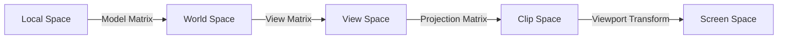

## 요약
> **요약**: 3D 공간의 정점이 2D 화면상의 픽셀로 변환되는 5단계 좌표계 변환 프로세스(Local → World → View → Clip → Screen)와 각 단계에서 사용되는 모델(Model), 뷰(View), 투영(Projection) 행렬의 역할을 분석합니다.

## 목차
* TOC
{:toc}

---

**자료 출처**: [LearnOpenGL](https://learnopengl.com/)

## 정규화 장치 좌표계 (NDC) 및 5단계 변환 프로세스

그래픽스 렌더링 파이프라인에서 3D 공간의 정점 좌표는 최종 디스플레이 픽셀로 변환되기 위해 일련의 좌표계 변환을 거칩니다. OpenGL은 최종 렌더링 좌표가 $[-1.0, 1.0]$ 범위의 **정규화 장치 좌표계(Normalized Device Coordinates, NDC)** 내에 위치하도록 요구합니다. 이 범위를 벗어난 좌표는 클리핑(Clipping)되어 화면에 표시되지 않습니다.

정점이 프래그먼트 단계에 도달하기 위해 거치는 5가지 공간 변환 과정은 다음과 같습니다.



{: width="700" style="background-color:white;" }
_버텍스에서 프래그먼트로의 5단계 변환 체인._

각 단계에서는 **모델(Model), 뷰(View), 투영(Projection)** 변환 행렬이 적용되어 좌표계의 기준을 변경하며, 이를 **MVP 변환**이라 칭합니다.

---

## 2. 좌표 변환 과정 상세

### 1단계: 로컬 좌표 (Local / Object Space)

로컬 좌표는 객체 고유의 원점(Local Origin, 보통 $(0,0,0)$)을 기준으로 한 상대 좌표입니다. 3D 저작 도구(Blender, Maya 등)에서 모델링 시 설정된 좌표계이며, `float vertices[]` 배열에 정의된 초기 데이터 상태를 의미합니다.

### 2단계: 월드 좌표 (World Space)

개별 객체들을 하나의 통합된 장면(Scene)에 배치하기 위해 전역 원점을 기준으로 좌표를 재정의하는 단계입니다. 모든 객체의 로컬 좌표는 공유된 월드 좌표계로 변환됩니다.

이 변환은 **모델 행렬 (Model Matrix)**을 통해 수행되며, 객체의 이동(Translation), 회전(Rotation), 크기 조정(Scale)을 담당합니다.

### 3단계: 뷰 좌표 (View / Eye Space)

월드 공간의 객체들을 관찰자(카메라)의 시점을 기준으로 재배치하는 단계입니다. 카메라의 위치가 새로운 원점이 되며, 카메라의 시선 방향이 기준축이 되도록 변환합니다.

이 변환은 **뷰 행렬 (View Matrix)**에 의해 수행됩니다.

### 4단계: 클립 좌표 (Clip Space)

뷰 공간 좌표를 가시 부피(View Frustum)를 기준으로 정규화된 부피로 변환하는 단계입니다. 화면에 표시되지 않는 영역의 정점들을 제거하는 클리핑 과정이 포함됩니다.

이 변환은 **투영 행렬 (Projection Matrix)**에 의해 수행됩니다. 투영 행렬은 3D 좌표를 $[-1.0, 1.0]$ 범위의 NDC로 맵핑하며, 가시 영역 밖의 좌표를 제거하여 연산 부하를 줄입니다.

> [!info] 
> **퍼스펙티브 디비전 (Perspective Division)**  
> 클립 공간으로 변환된 후, $x, y, z$ 좌표 요소를 동차 좌표계의 $w$ 요소로 나누는 연산이 수행됩니다. 이 과정을 통해 최종 NDC 좌표계 범위 $[-1.0, 1.0]$ 내에 좌표가 안착합니다.

---

## 3. 직교 투영과 원근 투영
### 직교 투영 (Orthographic Projection)

직교 투영은 가시 영역을 **직육면체 공간**으로 정의합니다. 투영선이 투영 평면과 직교하므로 거리에 따른 크기 변화(원근감)가 발생하지 않습니다. 주로 설계 도면이나 2D 그래픽 렌더링에 사용됩니다.

{: width="500" style="background-color:white;" }  

GLM에서는 `glm::ortho` 함수를 사용하여 직교 투영 행렬을 생성합니다.

```cpp
// left, right, bottom, top, near, far
glm::mat4 proj = glm::ortho(0.0f, 800.0f, 0.0f, 600.0f, 0.1f, 100.0f); 
``` 

### 원근 투영 (Perspective Projection)

사물이 멀어질수록 소실점으로 수렴하여 작게 보이도록 만드는 기법으로, 표준 3D 렌더링에서 주로 사용됩니다. 가시 영역은 **절두체(Frustum)** 형상을 띱니다.

{: width="500" style="background-color:white;" }  

원근 투영 행렬은 거리에 비례하여 $w$값을 조정하며, 퍼스펙티브 디비전 과정을 통해 깊이감 있는 시각적 효과를 생성합니다.

```cpp
// fov(라디안), Aspect Ratio, Near, Far
glm::mat4 proj = glm::perspective(glm::radians(45.0f), (float)width/(float)height, 0.1f, 100.0f);
```

> [!tip]
> `near` 평면 값을 `0.0f`에 가깝게 설정할 경우 깊이 버퍼의 정밀도 문제로 인해 Z-파이팅(Z-Fighting) 현상이 발생할 수 있으므로 주의가 필요합니다.

{: width="600" }
_원근 투영(좌)과 직교 투영(우)의 비교_

---

### 5단계: 화면 좌표 (Screen Space 매핑)

NDC 좌표는 `glViewport` 함수를 통해 정의된 윈도우 해상도 규격에 맞춰 **화면 좌표계(Screen Coordinates)**로 스케일링됩니다. 이후 래스터화 과정을 거쳐 프래그먼트로 변환됩니다.

---

## MVP 파이프라인 수식 결합

행렬 연산은 결합 법칙에 따라 우측에서 좌측으로 적용됩니다. 원본 정점 $V_{local}$에 MVP 행렬이 적용되어 최종 $V_{clip}$이 산출되는 공식은 다음과 같습니다.

$$
V_{clip} = M_{projection} \cdot M_{view} \cdot M_{model} \cdot V_{local}
$$

> [!warning]
> 행렬 곱셈 순서는 반드시 $Projection \times View \times Model$ 구조를 유지해야 합니다.

---

## 3D 렌더링 실전

### 1단계: 모델 행렬 (Model Matrix) 

객체를 월드 좌표계의 특정 위치나 방향으로 배치합니다.

```cpp
glm::mat4 model = glm::mat4(1.0f);
model = glm::rotate(model, glm::radians(-55.0f), glm::vec3(1.0f, 0.0f, 0.0f));
```

### 2단계: 뷰 행렬 (View Matrix) 

카메라의 시점을 정의합니다. 카메라를 이동시키는 것은 월드 내 모든 객체를 반대 방향으로 이동시키는 것과 물리적으로 동일합니다. OpenGL은 오른손 좌표계(Right-Handed System)를 사용하므로, 전방 시야는 $-Z$ 방향입니다.

```cpp
glm::mat4 view = glm::mat4(1.0f);
view = glm::translate(view, glm::vec3(0.0f, 0.0f, -3.0f));
```

### 3단계: 투영 및 셰이더 전송 (Projection Matrix)

원근 투영 행렬을 생성하여 셰이더로 전송합니다.

```cpp
glm::mat4 projection = glm::perspective(glm::radians(45.0f), 800.0f / 600.0f, 0.1f, 100.0f);
```

버텍스 셰이더에서 유니폼 변수로 수신하여 연산을 수행합니다.

```glsl
#version 330 core
layout (location = 0) in vec3 aPos;
uniform mat4 model;
uniform mat4 view;
uniform mat4 projection;

void main()
{
    gl_Position = projection * view * model * vec4(aPos, 1.0f);
}
```
{: file="shader.vert" }

{: width="500" }  
_MVP 변환이 적용된 정육면체 렌더링 결과_
