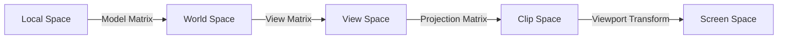

## 요약
> **요약**: 3D 공간의 정점(Vertex)이 2D 화면 픽셀(Fragment)로 그려지기까지 거치는 5단계 좌표계 변환 과정(로컬 ➡️ 월드 ➡️ 뷰 ➡️ 클립 ➡️ 스크린)과 모델(Model), 뷰(View), 투영(Projection) 행렬의 수학적 역할을 다룬다.

## 목차
* TOC
{:toc}

---

**자료 출처**: [LearnOpenGL](https://learnopengl.com/)

## 1. 정규화 장치 좌표계 (NDC)와 5단계 변환

그래픽스 렌더링 파이프라인에서 3D 공간상의 버텍스(Vertex) 좌표는 최종 디스플레이 픽셀로 변환되기 위해 여러 단계의 공간(Space) 좌표계 변환을 거쳐야 한다. OpenGL은 최종적으로 모든 렌더링 좌표가 $[-1.0, 1.0]$ 범위의 **정규화 장치 좌표계(Normalized Device Coordinates, NDC)** 안에 들어오기를 요구한다. 이 범위를 벗어난 기하 좌표는 화면 밖으로 간주되어 잘려나간다(Clipping).

하나의 버텍스가 온전히 프래그먼트로 도달하기 위해서는 행렬(Matrix) 연산의 도움을 받아 다음 5단계의 공간을 릴레이로 거치게 된다.



{: width="700" style="background-color:white;" }
_버텍스가 프래그먼트로 도달하는 5단계 변환 체인._

각 공간으로 넘어가는 관문마다 **모델(Model), 뷰(View), 투영(Projection)** 이라는 변환 행렬들이 개입하여 좌표계의 기준을 탈바꿈시킨다. 이 과정을 **MVP 변환**이라고도 부른다.

---

## 2. 좌표 변환 과정 상세 해석

### 1단계: 로컬 좌표 (Local / Object Space)

로컬 좌표는 객체 자기 자신의 고유한 원점(Local Origin, 보통 $(0,0,0)$)을 기준으로 한 상대 좌표다. 3D 모델링 툴(블렌더, 마야 등)에서 모델러가 스페이스바 중앙에 큐브를 모델링할 때 사용하는 바로 그 좌표계다. 프로그래머가 코드에 직접 입력하는 정점(Vertex) 데이터 배열(`float vertices[] = {...}`)이 바로 로컬 좌표다. 아직 세상(World)에 배치되지 않은 태아 상태와 같다.

### 2단계: 월드 좌표 (World Space)

우리가 만든 큐브 수십 개를 하나의 거대한 게임 스테이지(Global World)에 뿌리려면, 각 객체가 우주의 절대 원점을 기준으로 어디에 위치할지 정의해야 한다. 이것이 월드 좌표다. 모든 객체의 `로컬 좌표` 정점들을 통합 월드 원점 기준 좌표로 일괄 변환한다.

이 변환을 수행하는 것이 **모델 행렬 (Model Matrix)** 다.
모델 행렬은 각 객체의 위치를 지정(Translation), 방향을 조절(Rotation), 크기를 조정(Scale)하여 월드에 알맞게 세팅하는 역할을 수행한다.

### 3단계: 뷰 좌표 (View / Eye Space)

월드에 배치된 객체들을 이번에는 카메라(관찰자)의 렌즈를 기준으로 재배치한다. 아무리 거대한 월드라도 결국 모니터에 출력되는 것은 카메라의 시야뿐이기 때문이다. 카메라의 위치가 공간의 새로운 원점 $(0,0,0)$ 이 되고, 카메라가 바라보는 방향이 Z축이 되도록 모든 세상 만물들의 월드 좌표를 역산해 변환한다.

이를 수행하는 행렬이 **뷰 행렬 (View Matrix)** 이다. 뷰 행렬은 보통 카메라의 회전과 이동 변환값으로 구성된다.

### 4단계: 클립 좌표 (Clip Space)

뷰 공간 좌표를 모니터 화면 비율에 맞게 깎아내고 찌그러뜨려 상자 모양으로 가공하는 단계다. 화면에 보이지 않는 위치의 객체 정점들을 솎아내어 버리는 역할을 하는데, 이 절단 범위를 **가시 영역 (Frustum, 절두체)** 이라고 부른다.

이 변환을 지휘하는 것이 **투영 행렬 (Projection Matrix)** 이다.
투영 행렬은 3D 입체 좌표계의 공간적 느낌을 유지하면서 최종적으로 $[-1.0, 1.0]$ 범위를 갖는 정규화 좌표(NDC)로 압축 및 맵핑(Mapping)하는 연산을 담당한다. 가시 영역 밖의 좌표 지표들은 전부 잘려나가(Clipping) GPU의 렌더링 부하를 줄인다.

> [!info] 
> **퍼스펙티브 디비전 (Perspective Division, 원근 나눗셈)**  
> 투영 행렬이 곱해져 클립 공간으로 넘어간 뒤, 내부적으로 $x, y, z$ 좌표 요소들을 동차 좌표계의 $w$ 요소로 일제히 나누는 수학 연산이 일어난다. 이 나눗셈 결과물 비로소 최종 NDC 좌표계 범위 $[-1.0, 1.0]$ 에 온전히 안착하게 된다.

투영 행렬을 구성하는 방식에는 시야각(원근감)의 유무에 따라 크게 두 가지 기법이 존재한다.

---

## 3. 직교 투영과 원근 투영
### 직교 투영 (Orthographic Projection)

직교 투영 행렬은 카메라의 시야 역할을 하는 가시 영역을 **직육면체 평행 상자(Box) 공간**으로 정의한다. 투영 입사선과 투영 평면이 완전히 90도 직교(Orthogonal)하기 때문에 거리에 따른 크기 변화(원근감)가 철저히 배제된다. 멀리 있는 물체나 가까이 있는 물체나 모니터 상의 픽셀 크기가 동일하게 그려진다.

따라서 건축 설계 도면, CAD 프로그램, 혹은 심티시류의 2D 아이소메트릭(Isometric) 그래픽 전략 게임을 렌더링할 때 주로 쓰인다.

{: width="500" style="background-color:white;" }  

GLM에서는 `glm::ortho` 함수를 통해 이 육면체 상자의 좌/우/상/하/앞/뒤 한계경계 좌표값을 지정하여 직교 투영 행렬을 뽑아낸다. 직육면체 밖의 좌표는 전부 모가지가 잘려 클리핑 아웃된다.

```cpp
// left, right, bottom, top, near plane, far plane
glm::mat4 proj = glm::ortho(0.0f, 800.0f, 0.0f, 600.0f, 0.1f, 100.0f); 
``` 

### 원근 투영 (Perspective Projection)

인간의 안구 구조를 모방하여, 카메라 렌즈에서 사물이 멀어질수록 화면상의 투사가 작게 소실점(Vanishing Point)으로 수렴하도록 만드는 스탠다드 3D 투영 기법이다. 대부분의 3D 그래픽 엔진이 기본 뼈대로 채택한다.

가시 영역 공간이 육면체가 아닌 끝이 잘린 각뿔 형태인 **절두체(Frustum)** 형상을 띤다.

{: width="500" style="background-color:white;" }  

원근 투영 행렬은 거리가 멀수록(Z값이 클수록) $w$값을 의도적으로 비대하게 조작한다. 이후 파이프라인에서 자동으로 수행되는 일제 나눗셈(Perspective Division: $x/w, y/w, z/w$) 과정에서 분모인 $w$가 워낙 크다 보니 최종 $x, y$ 화면 투영 좌표값이 상대적으로 확 쪼그라들게 되어버리며 시각적인 원근의 깊이감이 창출된다.

GLM 구현 코드는 다음과 같다.

```cpp
// fov각도(라디안), 윈도우 종횡비(가로/세로), 근경계(Near), 원경계(Far)
glm::mat4 proj = glm::perspective(glm::radians(45.0f), (float)width/(float)height, 0.1f, 100.0f);
```

> [!tip]
> `near` 평면 값을 `0.0f`로 설정하면 심각한 깊이 버퍼(Depth), Z-파이팅 렌더링 오류가 터진다. 보통 `0.1f` 이상의 근사치를 할당한다.

{: width="600" }
_좌측: 원근 투영 적용 / 우측: 직교 투영 적용_

---

### 5단계: 화면 좌표 (Screen Space 좌표 매핑)

투영 행렬과 퍼스펙티브 디비전 트리거를 모두 거치고 살아남은 $[-1.0, 1.0]$ 규격의 순수한 NDC 제원들은 이제 최종적으로 C++ 코드 극초반에 선언했던 `glViewport` 함수를 타고 들어간다. 여기서 실제 모니터 윈도우 해상도(예: 800x600 픽셀) 규격에 맞게 쫙 펼쳐지면서 최종 **화면 좌표계(Screen Coordinates)** 로 스케일링된다. 그리고 래스터라이저(Rasterizer)를 타고 화려한 프래그먼트 유닛으로 잘게 쪼개져 픽셀을 장식한다.

---

## MVP 파이프라인 수식 결합 (Putting it together)

수학적으로 공간 이동(행렬의 곱셈)은 교환 법칙이 성립하지 않는다. 우측부터 좌측으로 곱해 나가는 벡터 수식의 관례에 따라 정점의 변환 공식은 다음과 같이 거꾸로 서술되어 곱해진다. 결과론적으로 원본 정점 $V_{local}$은 MVP 행렬을 두들겨 맞고 최종 $V_{clip}$이 되어 셰이더 결과물인 `gl_Position` 변수로 산출된다.

$$
V_{clip} = M_{projection} \cdot M_{view} \cdot M_{model} \cdot V_{local}
$$

> [!warning]
> **행렬 곱셈 순서**  
> 코드 작성 시에도 반드시 $Projection \times View \times Model$ 순서 구조로 행렬을 곱해야 정상 작동을 보장한다.

---

## 3D 입체 투영 실전 렌더링 (Going 3D)

이론 기반으로 다듬은 MVP 시스템을 이용해 본격적으로 입체 3D 공간을 회전하는 정육면체 큐브를 코드로 구현해보자.

### 1단계: 모델 행렬 (Model Matrix) 

우선 큐브를 바닥 지면을 향해 살짝 눕혀 X축을 기울이는 회전 모델 행렬을 선언해 월드 좌표로 탈바꿈시킨다.

```cpp
glm::mat4 model = glm::mat4(1.0f);
// X축(1.0, 0.0, 0.0)을 피벗으로 -55도 가량 고개를 뒤로 젖힌다
model = glm::rotate(model, glm::radians(-55.0f), glm::vec3(1.0f, 0.0f, 0.0f));
```

### 2단계: 뷰 투영 (View Matrix) 

큐브를 월드에 세워놨다고 해서 카메라 렌즈 바로 앞 눈두덩이에 바짝 붙여놓으면 아무것도 보이지 않는다. 카메라 촬영자가 뒤로 몇 발자국 물러서서 시야를 확보해야 한다. **"카메라가 뒤로 물러나는 것"은 수학적으로 "월드 전체의 사물들을 카메라의 반대 방향으로 밀어내는 것"과 물리적으로 완벽한 동치다.**

OpenGL은 근본적으로 오른손 좌표계(Right-Handed System)를 차용하고 있다. 카메라 렌지가 바라보는 시야 전방 뷰 방향은 $Z$축의 음수 방향($-Z$)에 해당한다. 따라서 뷰 매트릭스를 반대 음수 방위로 이격시킨다.

```cpp
glm::mat4 view = glm::mat4(1.0f);
// 세계의 뷰를 내 눈 앞 Z축 음수 방향으로 3미터 쯤 밀어낸다
view = glm::translate(view, glm::vec3(0.0f, 0.0f, -3.0f));
```

### 3단계: 투영 및 셰이더 송신 (Projection Matrix)

원근감을 위해 투영 행렬을 주조한다.

```cpp
glm::mat4 projection = glm::mat4(1.0f); // 선언 시 굳이 항등행렬로 안 덮어도 됨
// 가로세로 800:600 비율의 윈도우 스크린용 45도 시야각(FOV) 절두체를 주조한다
projection = glm::perspective(glm::radians(45.0f), 800.0f / 600.0f, 0.1f, 100.0f);
```

이제 버텍스 셰이더 GLSL 스크립트에 접속하여 이 거대한 MVP 행렬들을 각각 유니폼 변수로 연결하고 위치 변형을 촉발시킨다.

```glsl
#version 330 core
layout (location = 0) in vec3 aPos;
// ... 생략 ...
uniform mat4 model;
uniform mat4 view;
uniform mat4 projection;

void main()
{
    // Projection * View * Model 최후의 그랑블루 연산. 곱셈 순서를 반드시 확인할 것.
    gl_Position = projection * view * model * vec4(aPos, 1.0f);
    // ...
}
```
{: file="shader.vert" }

렌더링 루프 C++ 로직에 위치 참조를 걸고 값을 송신하는 과정은 이전과 완벽히 동일하다.

```cpp
// 셰이더 내부의 유니폼 레지스터 ID 쿼리
int modelLoc = glGetUniformLocation(ourShader.ID, "model");
glUniformMatrix4fv(modelLoc, 1, GL_FALSE, glm::value_ptr(model));
// View, Projection 도 똑같이 송신
```

{: width="500" }  
_MVP 변환을 모두 거친 후 원근감이 적용되어 바닥으로 살짝 눕혀진 컨테이너 박스의 모습._

3D 육면체 큐브(Cube)를 온전히 그리려면 정면에 보이는 사각형 1개(삼각형 2조각)만이 아니라 6개의 입체면(총 36개의 점 배열 데이터 배열)이 방대하게 VBO 버퍼에 로딩되어 있어야 한다. VBO 구조체를 늘려서 드로우콜을 날리면 완벽한 큐브가 화면에 돌아가기 시작한다.


