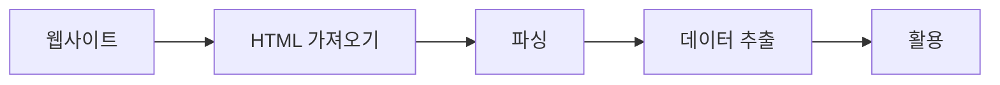

> **요약**: 파이썬 `requests`와 `BeautifulSoup` 라이브러리를 활용한 기본적인 웹 크롤링 방법론을 살펴본다. 페이지 요청부터 DOM 구조를 파싱해 원하는 데이터를 추출하는 5단계 사이클을 다룬다.
{: .prompt-info }

## 목차
* TOC
{:toc}

---

## 1. 개요

**웹 크롤링(Web Crawling)** 이란 웹에 있는 정보를 자동으로 가져와서 내가 필요한 데이터만 추출하는 작업이다.

파이썬에서는 `requests`와 `BeautifulSoup`이라는 훌륭한 라이브러리를 통해 간단하게 구현할 수 있다.

### 1.1. 크롤링 프로세스 흐름



---

## 2. 기본 크롤링 과정

### 2.1. 라이브러리 임포트

```python
import requests  
from bs4 import BeautifulSoup
```
{: file="crawler.py" }

*   **`requests`**: 특정 웹 페이지에 접속하고, 그 페이지의 HTML을 파이썬 코드로 가져오기 위해 사용한다.
*   **`BeautifulSoup`**: HTML 문서를 구조적으로 분석해 내가 원하는 정보를 쉽게 추출할 수 있도록 도와주는 파싱(Parsing) 라이브러리다.

이 두 라이브러리는 크롤링을 할 때 뼈대와 같은 기본 도구다.

### 2.2. 웹 페이지 가져오기

```python
res = requests.get('https://v.media.daum.net/v/20170615203441266')
```
{: file="crawler.py" }

*   `requests.get(URL)`은 해당 URL의 HTML 데이터를 요청(Request)하는 함수다.
*   반환된 `res` 객체에는 HTTP 통신 결과가 담겨 있으며, **웹사이트의 전체 HTML 코드**는 `res.content`로 확인할 수 있다.

**`res.content`의 특징:**
*   HTML 소스 전체가 **바이트(byte) 형태**로 들어있다.
*   실제 페이지 소스 보기(Ctrl + U)로 띄웠을 때와 동일한 HTML 코드가 담긴다.

### 2.3. 웹 페이지 파싱(Parsing) 하기

```python
soup = BeautifulSoup(res.content, 'html.parser')
```
{: file="crawler.py" }

*   HTML 문서를 **`html.parser` 파서**를 사용해 `BeautifulSoup` 객체로 변환한다.
*   이 과정은 **단순 텍스트 덩어리인 HTML을 구조화된 트리(Tree) 모델**로 치환해 주며, 이후 원하는 정보를 손쉽게 탐색할 수 있게 만든다.

`soup` 객체는 HTML 트리 전체를 메모리에 올린 상태이며, 이 안에서 `find`, `find_all`, `select` 같은 메서드로 목적 태그를 족집게처럼 집어낼 수 있다.

### 2.4. 원하는 데이터 추출하기

```python
mydata = soup.find('title')  
print(mydata.get_text())
```
{: file="crawler.py" }

*   `soup.find('태그명')`: Document 안에서 첫 번째로 매칭되는 해당 태그 노드를 찾아 반환한다.
    *   위 코드에서는 `<title>` 태그를 찾는다.
*   `.get_text()`: 해당 태그 내부에 감싸진 **순수 텍스트(Text Node)**만 추출한다 (불필요한 HTML 태그 껍데기를 다 벗겨낸다).

**예시 결과:**
```html
<!-- 원본 태그 내용 -->
<title>문재인 "한·미, 북핵 문제 해결 위해 긴밀히 협의"</title>
```
```text
# get_text() 실행 결과
문재인 "한·미, 북핵 문제 해결 위해 긴밀히 협의"
```

### 2.5. 추출한 데이터 활용하기

이렇게 걸러낸 데이터를 파일로 덤프를 뜨거나, DB에 밀어 넣는 식으로 마음대로 활용할 수 있다.

**파일 저장 예시:**
```python
# 파일로 저장  
with open('headline.txt', 'w', encoding='utf-8') as f:  
    f.write(mydata.get_text())
```
{: file="crawler.py" }

---

## 3. 재사용 가능한 기본 패턴

다음은 복사-붙여넣기해서 쓰기 좋은 크롤러 베이스라인 코드다.

```python
import requests  
from bs4 import BeautifulSoup  
  
res = requests.get('TARGET_URL')  
soup = BeautifulSoup(res.content, 'html.parser')  
data = soup.find('TARGET_TAG')  
print(data.get_text())
```
{: file="crawler.py" }

**변경 포인트:**
1.  `requests.get()` 인자로 들어갈 **타겟 URL**
2.  `soup.find()` 인자로 들어갈 **파싱 목적 HTML 태그** (class, id 속성 혼합 검색 가능)

---

## 4. 추가 탐색 팁

### 4.1. 태그명 외 속성으로 세밀하게 검색

단순히 태그 이름만 던지면 동명이인 노드들이 수백 개씩 딸려 나온다. 특정 `class`나 `id`를 가진 고유 요소 타겟팅이 필수적이다.

```python
soup.find('p', class_='special') # class 이름으로 필터 (class가 파이썬 예약어라 특수하게 언더바 붙임)
soup.find(id='headline')         # id 명칭으로 유일 노드 찾기
```
{: file="crawler.py" }

태그 목록 전체 배열을 끌어오려면 `find_all()`을 사용한다.

```python
soup.find_all('p')  # DOM 내 모든 <p> 태그를 리스트 형태로 리턴
```
{: file="crawler.py" }

---

## 5. 웹 사이트 근간 구조 이해하기

웹 문서를 해부하기 위해 알아야 할 기초적인 HTML 구조 명세다.

```html
<```html
<html>  
  <head>  
    <title>웹페이지 제목</title>  
  </head>  
  <body>  
    <p class="normal">본문 첫 번째 문장</p>  
    <p class="special">두 번째 문장 <b>굵게 표시됨</b></p>  
  </body>  
</html>
```
{: file="index.html" }

**주요 태그 설명:**
*   `<html>`: 문서의 뿌리(Root) 요소다.
*   `<head>`: 문서의 메타데이터(제목, 스타일, 인코딩 여부 등)가 들어가는 공간이다.
*   `<title>`: 브라우저 상단 탭에 표시될 제목이다.
*   `<body>`: 실제 유저의 시각적 화면에 렌더링되는 본문 내용이다.
*   `<p>`: 단락(문단), `<b>`: Bold(굵은 글씨) 처리다.

---

## 6. 웹 페이지의 3대 구성요소

웹 사이트의 프론트엔드는 다음 세 가지 언어의 융합으로 만들어진다.

| 언어 | 비유적 역할 | 실제 수행 기능 |
| :--- | :--- | :--- |
| **HTML** | 건물의 콘크리트 뼈대 (Structure) | 구조 정의, 텍스트 배치, 이미지 삽입 |
| **CSS** | 인테리어와 페인트칠 (Style) | 색상, 형태 지정, 여백 레이아웃 정렬 |
| **JavaScript** | 엘리베이터와 자동문 (Action) | 클릭 이벤트, 비동기 통신, 애니메이션 |

### 6.1. 마크업 태그(Tag) 구조

HTML(HyperText Markup Language)은 꺾쇠 괄호 `< >` 로 이루어진 마크업 태그 언어다.

```html
<b>Hello HTML</b>
```

*   **시작 태그**: `<b>`
*   **종료 태그**: `</b>`
*   **텍스트 콘텐츠**: 태그 사이에 위치한 문자열.

태그는 자유롭게 **중첩(Nesting)** 이 가능하다.

```html
<p>이 문장 안에 <b>굵은 글씨</b>가 있어요.</p>
```

### 6.2. 태그의 속성 (Attribute)

속성은 태그를 수식하는 메타데이터를 제공하며 시작 태그 내부에 작성된다. **크롤링 시 데이터가 묻힌 좌표를 역추적하는 핵심 단서가 된다.**

```html

```

*   ``: 이미지 렌더링 노드
*   `src`: 소스 파일 경로
*   `width`, `height`: 가로/세로 길이 픽셀 수치

### 6.3. 핵심 속성: id 와 class

HTML 크롤러의 8할은 `id`와 `class`를 찾아내는 게임이다. 이 두 식별자는 CSS 스타일링이나 JS 로직을 걸기 위해 마크업에 네임택을 붙이는 행위다.

```html
<h1 id="title">웹 제목</h1>  
<p class="content">본문입니다</p>
```

*   **`id="title"`**: 문서 전체에서 **단 한 번만 보장되는 고유 식별자(Unique ID)** 다. JS의 `getElementById`가 타겟팅하는 1순위 타겟이다.
*   **`class="content"`**: 복수의 요소들을 같은 디자인 템플릿으로 묶기 위한 **분류 카테고리(Group Name)** 다.

BeautifulSoup에서 `find(id='title')`, `find(class_='content')` 로 족집게 타겟팅을 수행하게 된다.

### 6.4. 필수 인코딩 방어 (UTF-8)

`GET` 요청으로 긁어온 한글 텍스트가 알 수 없는 특수 문자로 깨지는 것을 막으려면, 타겟 브라우저의 `<head>` 에 다음과 같은 명세가 있는지 확인해야 한다. (때로는 `requests.get` 이후 파이썬 크롤링 스크립트 레벨에서 명시적으로 `.encoding` 속성을 설정해야 할 때도 있다.)

```html
<head>  
  <meta charset="utf-8">  
</head>
```

### 6.5. 널리 쓰이는 HTML 치트시트

크롤러 개발자라면 다음 태그가 시각적으로 어떻게 쓰이는지 숙지해야 한다.

| 태그 | 역할 (Description) | 크롤링 타겟 사례 |
| :--- | :--- | :--- |
| `<h1>`~`<h6>` | 헤딩(제목). 1이 가장 큼 | 뉴스 스트립 기사 제목 추출 |
| `<p>` | 문단(Paragraph) 블록 | 기사 본문 스크래핑 |
| `<a href="URL">` | 앵커, 하이퍼링크 라우팅 | 페이징, 다음 게시물 URL 스파이더링 |
| `` | 이미지 소스 컨테이너 | 제품 썸네일 원본 이미지 URL 추출 |
| `<table>`, `<tr>`, `<td>` | 정형 테이블 행렬 | 증권가 재무제표 차트 데이터 긁어오기 |
| `<div>`, `<span>` | 범용 공간 분할 레이아웃 | 통짜 텍스트 덩어리를 쪼개기 위한 상위 컨테이너 검색 |

---

## 7. HTML 소스 코드 실전 분석

간단한 Mockup HTML 코드가 주어졌을 때 이를 뜯어보는 눈을 길러보자.

```html
<!DOCTYPE html>
<html>
<head>
    <title>HTML TEST</title>
    <meta charset="utf-8">
    <link rel="stylesheet" type="text/css" href="css/style.css">
</head>
<body>
    <b>안녕</b><br>
    
    
    <table border="1" width="500">
        <thead>
            <tr>
                <th>title1</th>
                <th>title2</th>
            </tr>
        </thead>
        <tbody>
            <tr>
                <td class="highlight">안녕1</td>
                <td>안녕2</td>
            </tr>
        </tbody>
    </table>
</body>
</html>
```
{: file="index.html" }

이 트리 구조를 바탕으로 파이썬 스크래핑을 한다고 가정하면, 다음과 같은 구조적 파악이 즉각 가능해야 한다.

### 7.1. 타겟팅 구조 요약

| DOM 구역 | 내재된 의미 / 역할 | 스크래핑 표적 가치 |
| :--- | :--- | :--- |
| **`<head>` 영역** | 문서 제원 (인코딩, 타이틀, 외부 리소스 링크) | 헤드라인, 썸네일 메타 정보, SEO 태그 덤프 |
| **`<body>` 영역** | 페이지 내 브라우저에 페인팅되는 모든 실물 가시 콘텐츠 | 전체 크롤링의 주 무대 |
| **`<table>` 트리** | `thead` (제목행) 묶음과 `tbody` (데이터행) 묶음 복합체 | 표 형태의 관계형 통계 데이터 파싱 최적화 요소 |
| **`<th>`, `<td>`** | 표 각 셀 데이터. 헤더(제목)와 일반 데이터 표기용 컴포넌트 | 열/행 반복 `for` 루프 스크래핑 대상 포인트 |
| **`class="highlight"`** | 특정 행/열에 CSS 시각 하이라이팅 표식 | 강조 처리된 이벤트 타임 특가 상품 같은 특이점 색인 기점 |

---

## 8. CSS (Cascading Style Sheets) 기초

### 8.1. CSS란?

*   HTML 구조를 시각적으로 단장(꾸미기, 레이아웃 등)하는 전용 스타일링 언어다.
*   크롤링에서는 색깔이나 모양 자체가 중요하다기보다, CSS를 입히기 위해 선언해 둔 `class`나 기타 속성 규칙들이 훌륭한 스크래핑 단서(Selector)가 된다.

### 8.2. CSS 적용 방식 3가지

| 방식 | 설명 | 예시 | 장단점 |
| :--- | :--- | :--- | :--- |
| **인라인 스타일** | 태그에 1:1로 직접 작성 | `<p style="color:red;">문장</p>` | 구현은 쉽지만 유지보수 시 지옥이 열림 |
| **내부 스타일** | HTML `<head>` 안의 `<style>` 구역 | `<style> p { color:red; } </style>` | 한 페이지 렌더링엔 좋으나 범용성 떨어짐 |
| **외부 스타일** | 별도 `.css` 파일로 분리 연결 | `<link rel="stylesheet" href="style.css">` | 재사용성이 가장 높고 웹 표준에 부합함 |

### 8.3. 자주 쓰이는 CSS 속성

| 속성 (Property) | 역할 (Description) | 값 예제 |
| :--- | :--- | :--- |
| `color` | 글자(Foreground) 색상 | `red`, `#0277BD` |
| `font-size` | 글자 윤곽 크기 | `16px`, `2em` |
| `font-family` | 서체(글꼴) 세트 | `Gulim`, `Arial` |
| `text-align` | 문자열 정렬 구도 | `left`, `center`, `right` |

### 8.4. CSS 스타일 코드 해부 - style.css

```css
td {
    font-size: 2em;
    font-family: Gulim;
    text-align: center;
}

.highlight {
    font-size: 3em;
    text-align: right;
    color: blue;
}
```
{: file="style.css" }

**태그 선택자 (Tag Selector): `td`**
문서 내의 모든 `<td>` 노드를 멱살 잡고 다음 스타일을 강제 적용한다. (크기 2배, 굴림체, 중앙정렬)

**클래스 선택자 (Class Selector): `.highlight`**
앞에 붙은 쩜(`.`) 표시는 클래스를 의미한다. 즉 `<td class="highlight">` 처럼 명시적으로 꼬리표가 붙은 노드들에만 치명적인 파란색 3배 크기 우측 정렬 속성을 덧씌운다.

### 8.5. 겹치는 속성의 최후 승자는? (Cascading)

만약 아래처럼 두 규칙의 지배를 동시에 받는다면?

```html
<td class="highlight">적용 결과</td>
```

*   **`td` 룰 패스:** 굴림체 장착 완료
*   **`.highlight` 룰 패스:** 기존 2배 크기는 3배 크기로 덮어씌워지고 (오버라이드), 중앙 정렬은 우측 정렬로 밀려나며, 파란색이 입혀진다.

이러한 **계단식(Cascading) 상속 및 덮어쓰기 논리**가 바로 CSS의 본질이다. 파이썬 `BeautifulSoup`의 `.select()` 메서드를 사용하면 이런 CSS 선택자 문법(`td.highlight`)을 역으로 활용해 노드를 단번에 사냥할 수 있다.

---

## 9. 실전 웹 크롤러 완성의 지름길

스크래핑 코드 한 줄을 덜 짜기 위해 고민하기 전에, **브라우저의 F12(개발자 도구)** 를 적극 활용해 타겟 DOM을 눈에 익히는 과정이 100배는 성과가 좋다. 

이 문서의 **5단계 파이프라인(요청 → 파싱 → 타겟팅 → 정제 → 적재)** 을 체화하고 다음 체크리스트를 달성한다면 중급 크롤러로 성장할 수 있다.

☑️ **체크리스트**
- [ ] HTML 계층 트리의 부모-자식-형제 논리 파악
- [ ] `requests.get()`과 `BeautifulSoup` 의 리턴 객체 특징 숙지
- [ ] 식별자(`id`, `class`)를 활용한 정밀한 노드 타겟팅
- [ ] 브라우저 개발자 도구(F12) `Elements` 탭과 친해지기
- [ ] 다양한 실 서비스 웹사이트(뉴스, 주식 랭킹 등)를 타겟으로 배운 내용 응용해보기

