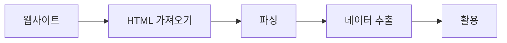

## 요약
> **요약**: 파이썬 `requests`와 `BeautifulSoup` 라이브러리를 활용한 웹 크롤링 방법론을 고찰한다. 페이지 요청부터 DOM 구조 파싱, 데이터 추출에 이르는 프로세스 전반을 체계적으로 다룬다.

## 목차
* TOC
{:toc}

---

## 1. 개요

**웹 크롤링(Web Crawling)**이란 웹상의 정보를 자동화된 방식으로 수집하여 필요한 데이터를 추출하는 프로세스다.

파이썬 환경에서는 `requests`와 `BeautifulSoup` 라이브러리를 통해 이를 효율적으로 구현할 수 있다. 

### 1.1. 크롤링 아키텍처 흐름



---

## 2. 기본 크롤링 과정

### 2.1. 라이브러리 임포트

```python
import requests  
from bs4 import BeautifulSoup
```
{: file="crawler.py" }

*   **`requests`**: 특정 웹 페이지에 접속하고, 그 페이지의 HTML을 파이썬 코드로 가져오기 위해 사용한다.
*   **`BeautifulSoup`**: HTML 문서를 구조적으로 분석해 내가 원하는 정보를 쉽게 추출할 수 있도록 도와주는 파싱(Parsing) 라이브러리다.

이 두 라이브러리는 크롤링을 수행할 때 뼈대가 되는 기본 도구다.

### 2.2. 웹 페이지 가져오기

```python
res = requests.get('https://v.media.daum.net/v/20170615203441266')
```
{: file="crawler.py" }

*   `requests.get(URL)`은 해당 URL의 HTML 데이터를 요청(Request)하는 함수다.
*   반환된 `res` 객체에는 HTTP 통신 결과가 담겨 있으며, **웹사이트의 전체 HTML 코드**는 `res.content`로 확인할 수 있다.

**`res.content`의 특징:**
*   HTML 소스 전체가 **바이트(byte) 형태**로 포함되어 있다.
*   실제 페이지 소스 보기(Ctrl + U)로 확인했을 때와 동일한 HTML 코드가 담긴다.

### 2.3. 웹 페이지 파싱(Parsing) 하기

```python
soup = BeautifulSoup(res.content, 'html.parser')
```
{: file="crawler.py" }

*   HTML 문서를 **`html.parser` 파서**를 사용해 `BeautifulSoup` 객체로 변환한다.
*   이 과정은 **단순 텍스트 덩어리인 HTML을 구조화된 트리(Tree) 모델**로 치환해 주며, 이후 원하는 정보를 손쉽게 탐색할 수 있게 만든다.

`soup` 객체는 HTML 트리 전체를 메모리에 올린 상태이며, 이 안에서 `find`, `find_all`, `select` 같은 메서드로 목적 태그를 정확히 찾아낼 수 있다.

### 2.4. 원하는 데이터 추출하기

```python
mydata = soup.find('title')  
print(mydata.get_text())
```
{: file="crawler.py" }

*   `soup.find('태그명')`: Document 안에서 첫 번째로 매칭되는 해당 태그 노드를 찾아 반환한다.
    *   위 코드에서는 `<title>` 태그를 찾는다.
*   `.get_text()`: 해당 태그 내부에 포함된 **순수 텍스트(Text Node)**만 추출한다.

**예시 결과:**
```html
<!-- 원본 태그 내용 -->
<title>문재인 "한·미, 북핵 문제 해결 위해 긴밀히 협의"</title>
```
```text
# get_text() 실행 결과
문재인 "한·미, 북핵 문제 해결 위해 긴밀히 협의"
```

### 2.5. 추출한 데이터 활용하기

이렇게 걸러낸 데이터를 파일로 저장하거나, DB에 저장하는 등 자유롭게 활용할 수 있다.

**파일 저장 예시:**
```python
# 파일로 저장  
with open('headline.txt', 'w', encoding='utf-8') as f:  
    f.write(mydata.get_text())
```
{: file="crawler.py" }

---

## 3. 재사용 가능한 기본 패턴

다음은 복사하여 사용하기 좋은 크롤러 베이스라인 코드다.

```python
import requests  
from bs4 import BeautifulSoup  
  
res = requests.get('TARGET_URL')  
soup = BeautifulSoup(res.content, 'html.parser')  
data = soup.find('TARGET_TAG')  
print(data.get_text())
```
{: file="crawler.py" }

**변경 포인트:**
1.  `requests.get()` 인자로 들어갈 **타겟 URL**
2.  `soup.find()` 인자로 들어갈 **파싱 목적 HTML 태그** (class, id 속성 혼합 검색 가능)

---

## 4. 추가 탐색 팁

### 4.1. 태그명 외 속성으로 세밀하게 검색

단순히 태그 이름만 사용하면 여러 노드가 검색될 수 있다. 특정 `class`나 `id`를 가진 고유 요소를 타겟팅하는 것이 필요하다.

```python
soup.find('p', class_='special') # class 이름으로 필터 (class가 파이썬 예약어라 특수하게 언더바 붙임)
soup.find(id='headline')         # id 명칭으로 유일 노드 찾기
```
{: file="crawler.py" }

태그 목록 전체 배열을 가져오려면 `find_all()`을 사용한다.

```python
soup.find_all('p')  # DOM 내 모든 <p> 태그를 리스트 형태로 리턴한다.
```
{: file="crawler.py" }

---

## 5. 웹 사이트 근간 구조 이해하기

웹 문서를 분석하기 위해 알아야 할 기초적인 HTML 구조 명세다.

```html
<html>  
  <head>  
    <title>웹페이지 제목</title>  
  </head>  
  <body>  
    <p class="normal">본문 첫 번째 문장</p>  
    <p class="special">두 번째 문장 <b>굵게 표시됨</b></p>  
  </body>  
</html>
```
{: file="index.html" }

**주요 태그 설명:**
*   `<html>`: 문서의 뿌리(Root) 요소다.
*   `<head>`: 문서의 메타데이터(제목, 스타일, 인코딩 여부 등)가 포함되는 공간이다.
*   `<title>`: 브라우저 상단 탭에 표시될 제목이다.
*   `<body>`: 실제 사용자의 화면에 렌더링되는 본문 내용이다.
*   `<p>`: 단락(문단), `<b>`: Bold(굵은 글씨) 처리를 의미한다.

---

## 6. 웹 페이지의 3대 구성요소

웹 사이트의 프론트엔드는 다음 세 가지 언어의 결합으로 구성된다.

| 언어 | 비유적 역할 | 실제 수행 기능 |
| :--- | :--- | :--- |
| **HTML** | 건물의 뼈대 (Structure) | 구조 정의, 텍스트 배치, 이미지 삽입 |
| **CSS** | 인테리어와 디자인 (Style) | 색상, 형태 지정, 여백 레이아웃 정렬 |
| **JavaScript** | 엘리베이터와 기능 (Action) | 클릭 이벤트, 비동기 통신, 애니메이션 |

### 6.1. 마크업 태그(Tag) 구조

HTML(HyperText Markup Language)은 꺾쇠 괄호 `< >` 로 이루어진 마크업 태그 언어다.

```html
<b>Hello HTML</b>
```

*   **시작 태그**: `<b>`를 의미한다.
*   **종료 태그**: `</b>`를 의미한다.
*   **텍스트 콘텐츠**: 태그 사이에 위치한 문자열을 말한다.

태그는 자유롭게 **중첩(Nesting)** 이 가능하다.

```html
<p>이 문장 안에 <b>굵은 글씨</b>가 있다.</p>
```

### 6.2. 태그의 속성 (Attribute)

속성은 태그를 수식하는 메타데이터를 제공하며 시작 태그 내부에 작성된다. **크롤링 시 데이터가 위치한 좌표를 추적하는 핵심 단서가 된다.**

```html

```

*   ``: 이미지 렌더링 노드를 의미한다.
*   `src`: 소스 파일 경로를 나타낸다.
*   `width`, `height`: 가로/세로 길이 픽셀 수치를 지정한다.

### 6.3. 핵심 속성: id 와 class

HTML 크롤링에서 `id`와 `class`를 찾아내는 과정은 매우 중요하다. 이 두 식별자는 디자인이나 로직을 적용하기 위해 마크업에 이름을 붙이는 행위다.

```html
<h1 id="title">웹 제목</h1>  
<p class="content">본문입니다</p>
```

*   **`id="title"`**: 문서 전체에서 **단 한 번만 보장되는 고유 식별자(Unique ID)** 다.
*   **`class="content"`**: 복수의 요소들을 동일한 템플릿으로 묶기 위한 **분류 카테고리(Group Name)** 다.

BeautifulSoup에서 `find(id='title')`, `find(class_='content')` 로 정확한 타겟팅을 수행할 수 있다.

### 6.4. 필수 인코딩 방어 (UTF-8)

`GET` 요청으로 가져온 한글 텍스트가 깨지는 것을 방지하려면, 대상 브라우저의 `<head>` 에 다음과 같은 명세가 있는지 확인해야 한다.

```html
<head>  
  <meta charset="utf-8">  
</head>
```

### 6.5. 널리 쓰이는 HTML 치트시트

크롤러 개발을 위해 다음 태그들의 용도를 숙지해야 한다.

| 태그 | 역할 (Description) | 크롤링 타겟 사례 |
| :--- | :--- | :--- |
| `<h1>`~`<h6>` | 헤딩(제목)을 의미한다. | 뉴스 기사 제목 추출 |
| `<p>` | 문단(Paragraph) 블록을 나타낸다. | 기사 본문 스크래핑 |
| `<a href="URL">` | 하이퍼링크 라우팅을 수행한다. | 페이징 및 다음 게시물 URL 분석 |
| `` | 이미지 소스 컨테이너다. | 제품 썸네일 이미지 URL 추출 |
| `<table>`, `<tr>`, `<td>` | 정형 테이블 행렬 구조다. | 통계 및 재무 데이터 추출 |
| `<div>`, `<span>` | 범용 공간 분할 레이아웃이다. | 상위 컨테이너 검색 및 분할 |

---

## 7. HTML 소스 코드 실전 분석

간단한 HTML 코드를 분석하는 능력을 기르는 것이 중요하다.

```html
<!DOCTYPE html>
<html>
<head>
    <title>HTML TEST</title>
    <meta charset="utf-8">
    <link rel="stylesheet" type="text/css" href="css/style.css">
</head>
<body>
    <b>안녕</b><br>
    
    
    <table border="1" width="500">
        <thead>
            <tr>
                <th>title1</th>
                <th>title2</th>
            </tr>
        </thead>
        <tbody>
            <tr>
                <td class="highlight">안녕1</td>
                <td>안녕2</td>
            </tr>
        </tbody>
    </table>
</body>
</html>
```
{: file="index.html" }

이 트리 구조를 바탕으로 스크래핑을 수행할 때, 다음과 같은 구조적 파악이 즉각 가능해야 한다.

### 7.1. 타겟팅 구조 요약

| DOM 구역 | 내재된 의미 / 역할 | 스크래핑 표적 가치 |
| :--- | :--- | :--- |
| **`<head>` 영역** | 문서 제원을 나타낸다. | 메타 정보 및 SEO 태그 추출 |
| **`<body>` 영역** | 화면에 표시되는 모든 실물 콘텐츠를 포함한다. | 전체 크롤링의 주 대상 |
| **`<table>` 트리** | 행과 열의 복합체 구조다. | 관계형 데이터 파싱에 최적화 |
| **`<th>`, `<td>`** | 표의 개별 셀 데이터를 의미한다. | 반복 루프를 통한 데이터 추출 포인트 |
| **`class="highlight"`** | 특정 요소에 대한 시각적 표식을 나타낸다. | 특이점 색인 및 강조 데이터 추출 |

---

## 8. CSS (Cascading Style Sheets) 기초

### 8.1. CSS란?

*   HTML 구조를 시각적으로 디자인하는 전용 언어다.
*   크롤링에서는 `class`나 기타 속성 규칙들이 데이터를 찾기 위한 중요한 단서가 된다.

### 8.2. CSS 적용 방식 3가지

| 방식 | 설명 | 예시 | 장단점 |
| :--- | :--- | :--- | :--- |
| **인라인 스타일** | 태그에 직접 작성한다. | `<p style="color:red;">문장</p>` | 구현은 쉬우나 유지보수가 어렵다. |
| **내부 스타일** | HTML 내부 `<style>` 구역에 작성한다. | `<style> p { color:red; } </style>` | 범용성이 낮다. |
| **외부 스타일** | 별도 `.css` 파일로 연결한다. | `<link rel="stylesheet" href="style.css">` | 재사용성이 높고 표준에 부합한다. |

### 8.3. 자주 쓰이는 CSS 속성

| 속성 (Property) | 역할 (Description) | 값 예제 |
| :--- | :--- | :--- |
| `color` | 글자 색상을 지정한다. | `red`, `#0277BD` |
| `font-size` | 글자 크기를 조절한다. | `16px`, `2em` |
| `font-family` | 서체를 설정한다. | `Gulim`, `Arial` |
| `text-align` | 문자열 정렬 방식을 결정한다. | `left`, `center`, `right` |

### 8.4. CSS 스타일 코드 해부 - style.css

```css
td {
    font-size: 2em;
    font-family: Gulim;
    text-align: center;
}

.highlight {
    font-size: 3em;
    text-align: right;
    color: blue;
}
```
{: file="style.css" }

**태그 선택자 (Tag Selector): `td`**
문서 내의 모든 `<td>` 노드에 스타일을 적용한다.

**클래스 선택자 (Class Selector): `.highlight`**
앞에 점(`.`)이 붙은 것은 클래스를 의미하며, 해당 클래스가 지정된 노드들에만 스타일을 적용한다.

### 8.5. 겹치는 속성의 처리 (Cascading)

만약 두 규칙의 영향을 동시에 받는다면 다음과 같이 처리된다.

```html
<td class="highlight">적용 결과</td>
```

*   **`td` 규칙 적용:** 서체 설정이 완료된다.
*   **`.highlight` 규칙 적용:** 기존 속성을 덮어쓰거나 새로운 스타일이 추가된다.

이러한 **계단식(Cascading) 상속 및 덮어쓰기 논리**가 CSS의 핵심이다. BeautifulSoup의 `.select()` 메서드를 활용하면 이러한 선택자 문법을 사용하여 노드를 효율적으로 검색할 수 있다.

---

## 9. 결론 및 향후 과제

효율적인 크롤러 개발을 위해서는 구현에 앞서 브라우저 개발자 도구를 활용한 DOM 분석이 선행되어야 한다.

본 문서에서 다룬 **5단계 파이프라인(요청 → 파싱 → 타겟팅 → 정제 → 적재)**을 숙달하여 다양한 환경에 적용해 보길 바란다.

**체크리스트**
- [x] HTML 계층 구조 및 DOM 트리 논리 이해
- [x] `requests` 및 `BeautifulSoup` 객체의 주요 메서드 숙지
- [x] 식별자(`id`, `class`) 기반의 정밀 노드 타겟팅 수행
- [x] 브라우저 개발자 도구를 활용한 요소 분석 숙달
- [ ] 실제 서비스 대상의 응용 크롤러 구현 및 예외 처리 학습
